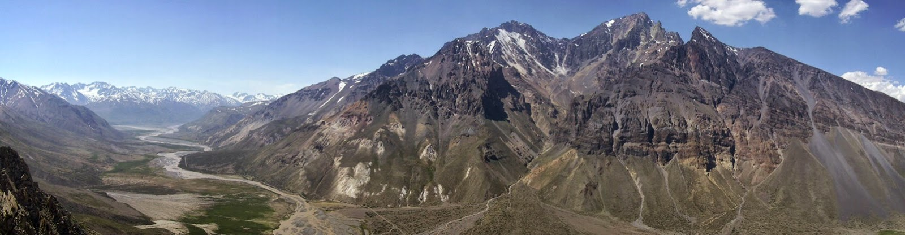

# Escalada en Sosneado — Ubicación y Acceso

**Blog fuente:** https://escaladaensosneado.blogspot.com
**Autor:** Lucas Alzamora | lucasalzamora@yahoo.com
**Actualizado:** Noviembre 2020

---

## Ubicación Geográfica

El valle del Sosneado se encuentra en el **sur de la provincia de Mendoza**, en la localidad de **Malargüe**, a 100 km de la misma y a 210 km de San Rafael.

---

## Acceso

### Ruta desde San Rafael
1. Tomar **Ruta Nacional 143** hacia el sur hasta Malargüe
2. Desde Malargüe, tomar **Ruta Nacional 40** sur y luego **Ruta Nacional 146** hacia el oeste
3. Llegar al pueblo de **Sosneado** sobre la ruta 146
4. Desde el pueblo, un **camino de ripio** conduce a la Laguna del Sosneado

### Ruta desde Malargüe
- 100 km al norte-oeste por Rutas 40 y 146

---

## Campamentos

### Campamento Alto
- **Coordenadas:** -34.81740532297685, -70.00786596466965
- Punto de partida principal para las agujas del circo superior

### Campamento Agua (Río)
- **Coordenadas:** -34.82197390200938, -70.00566898673937
- Campamento base cerca del río

---

## Servicios y Contactos

### Transporte
- **Empresa Iselin** — Desde San Rafael (transporte público)
- **Camioneta 4x4:** Miguel Merlo — Tel: **(0260) 15-4610300**
  (Recomendado para el tramo final de ripio con cruce de ríos)

### Arrieros / Puesto local
- **Sr. Dante y Marcelino** — Puesto a 53 km del inicio
- Disponibles: **Diciembre a Mayo**

### Contacto del blog / guía
- **Lucas Alzamora:** lucasalzamora@yahoo.com

---

## Temporada

La temporada óptima de escalada es **noviembre a abril/mayo**.
En invierno el acceso por ripio se corta por nieve y los ríos se congelan.

---

## Imágenes

**Fuente original:**
https://blogger.googleusercontent.com/img/b/R29vZ2xl/AVvXsEh1oEsSh3Qo1G6peNOtXrq2oY7rfHHaGx1OE_Db978Y-_tvlV4rjYFtFiUJTWgAKhgJ08zGnDkrM03FWJ85r-rBG1gAoxbw-1tOIGQyT68s3R62fK-Voppwkis7xxi6xbtq2d3R5O6qQxcu/s1600/tapa.jpg

---

## Descripción Original

Sosneado es una pequeña localidad de la provincia de Mendoza, Argentina, en el departamento San Rafael. Para ingresar al valle hay que cruzar el río Atuel y adentrase unos 18kms por una huella que solo es accesible en 4x4 o a caballo. Existe servicio de arriero desde la localidad de Sosneado, se puede contratar con Miguel Merlo (tel: 0260-15-4610300) quien también arrenda caballos y ofrece alojamiento.

El paraje se llama "La Pintada" y es un lugar maravilloso y prístino. El campo de escalada en sí mismo, queda aproximadamente a 4hs de marcha desde el puesto del arriero. El lugar es sumamente agreste, y aunque hay algunas sendas de animales, el camino no es siempre evidente.

La zona tiene formaciones de granito de excelente calidad que ofrecen escalada en fisura de primer nivel. Hay vías de todos los grados, aunque predomina la escalada en fisura de un nivel técnico medio a alto.

**Temporada:** Primavera y otoño son las mejores épocas. En verano hace mucho calor y en invierno nieva.

**Coordenadas GPS campamento:** 35°08'S, 70°05'W aprox.

**Contacto arriero:** Miguel Merlo, tel: 0260-15-4610300
