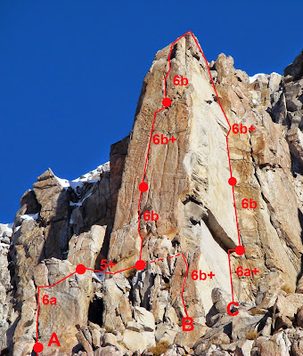
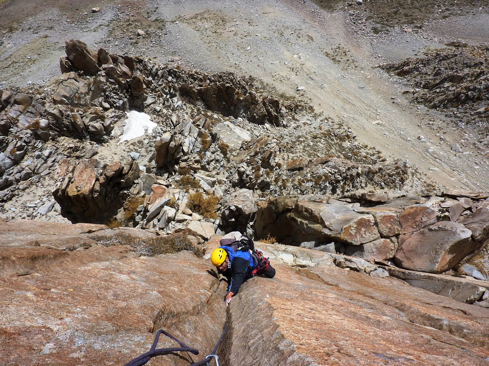
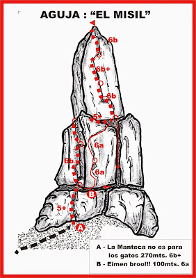
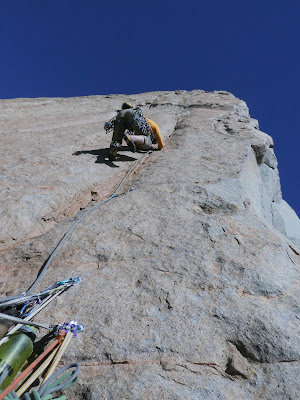
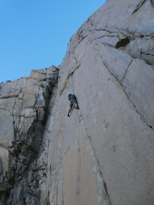

# Aguja: EL MISIL

**URL blog:** https://escaladaensosneado.blogspot.com/2014/10/aguja-el-misil.html
**Publicado:** Octubre 2014 | **Autor:** Lucas Alzamora

---

## Descripción General

"Una de las agujas emblemáticas de la zona, todas sus vías son de excelente calidad y siempre sobre roca perfecta y un grado de escalada medio, sostenido."

La aguja se caracteriza por su parte final muy característica con "una gran pared cónica que termina en forma de cabeza de un gran misil."

---

## Imágenes

URLs originales:
- https://blogger.googleusercontent.com/img/b/R29vZ2xl/AVvXsEjAz86ZVp9XGu4wagf3_jq09k4I_248klcYhlNQ3gv3wkMrhYqamMRC0qrMxqkuheG54gxcVq1Kn__6Ni24wrGNFI_Xqre1ENeEorHPCKUWOe7n0gRKjFWm7-gYXGT88LPCRxQY6P-oTLcQ/s400/mi1.JPG
- https://blogger.googleusercontent.com/img/b/R29vZ2xl/AVvXsEiM_5ECdI5GEI3y_HGBwfLqHRi7U8ZyGpa1gg_tHqN9STriVMY8-mCNovqGwnoywCrKtJAc5L9mI4qe_5-sZNOfBoV_9FTzW_H8o3t8bb9HEqQT_lwfP-qsBfwkslEuENFOdLGxDYDDqRq6/s1600/mi2.jpg
- https://blogger.googleusercontent.com/img/b/R29vZ2xl/AVvXsEhzdIczS1-u2Rab9GPdHL29ylhJUuoh_mtvDK_3mzvDK_3mXrheAM4NNHD7jtpaGRi46LyF3SqYnbN9roc00y8AEaJ6WfhYczZ8msKswcX5kCUTyMMG7n40MYbptlvA4XGFjGE4cUFnHWmNdY-JkTJ/s400/mi5.jpg

---

## CARA NORTE

**Aproximación:** Tomar el "gran acarreo" hasta el canal que sigue al del gran bloque/cueva. **Tiempo: ~2 horas.**

---

### Vía 1: "LA MANTECA NO ES PARA LOS GATOS" ⭐⭐⭐⭐⭐
- **Largo total:** 270 metros
- **Grado:** 6b+
- **Primer ascenso:** Lucas Alzamora, Diego Nakamura, Maxi Astete Millan y David Salazar (Diciembre 2008)

| Largo | Metros | Grado | Descripción |
|-------|--------|-------|-------------|
| 1° | 50m | 5+ | La vía comienza al final del canal, a la izq de una fisura/chimenea, sobre una placa fisurada algo tumbada. Buscar fisuras más evidentes que llevan a amplia repisa con reunión bajo el diedro del 2° largo. (2 chapas con argolla) |
| 2° | 50m | 6b+ | Salir a plataforma, tomar fisura de manos sobre placa que tras pasar una laja lleva directo al diedro. Al final, superar bloque desplomado hasta amplio balcón con reunión. |
| 3° | 45m | 6a | Seguir por fisuras fáciles, rodear gran bloque por la izquierda hasta ver la cabeza del misil. Travesía hacia la derecha sobre la parte baja de la placa del misil. (2 chapas con argolla) |
| 4° | 40m | 6b | Subir la cabeza del misil por fisura ancha hasta pequeño techo, superarlo y buscar sistema de fisuras directo a cumbre. Reunión bien aérea. (2 chapas con argolla) |
| 5° | 40m | 6b+ | Saliendo de reunión la fisura se transforma en un offwidth corto con los pasajes más difíciles de toda la vía. Luego vuelve a tamaño cómodo para empotre manos/puños. (2 chapas con argolla) |
| 6° | 40m | 6a+/b | Seguir el sistema de fisuras con pasajes atléticos y excelentes movimientos directo a la cumbre del misil. (2 chapas con argolla) |

**Material:** Un juego completo de camalots con algunos repetidos (#1, #2, #3) y **sin falta un #5 para el 5° largo**. Cintas largas, 2 cuerdas de 50m, material de reunión y varios mosquetones.

**Bajada:** Los 3 primeros rappeles por la línea de subida. El siguiente por dentro del canal, continuar destrepando hasta encontrar la 1° reunión de la vía.

---

### Vía 2: "EIMEN BROO!!!" (variante) ⭐⭐⭐
- **Largo total:** 100 metros
- **Grado:** 6a
- **Primer ascenso:** Lucas Alzamora y Diego Nakamura (Diciembre 2008)

Desde la 1° reunión de "La manteca..." salir hacia la derecha. Se puede montar en pequeñas fisuras sobre un espolón (6b, Viri Bovo y Macu Zanotti, septiembre 2011) o continuar ganando altura por bloques hasta la gran placa.

| Largo | Metros | Grado | Descripción |
|-------|--------|-------|-------------|
| 1° | 50m | 6a | Progresar por buenas fisuras hasta pequeño diedro con fisura muy angosta y una laja en punta en su base. Reunión en pequeño nicho. |
| 2° | 50m | 6a | Salir directo por fisuras de mano perfectas y a ~20m comenzar travesía hacia la derecha que conduce a reunión justo debajo de la cabeza del misil. (2 chapas con argolla) |

---

### Vía 3: "DIRECTO A LA CABEZA" (variante) ⭐⭐⭐
- **Largo total:** 60 metros
- **Grado:** 6b
- **Primer ascenso:** Lucas Alzamora y Carloncho (4 septiembre 2011)

Misma aproximación que "La manteca..." pero antes de entrar al primer largo, montar por grandes bloques a la derecha.

| Largo | Metros | Grado | Descripción |
|-------|--------|-------|-------------|
| Único | 60m | 6b | Salir sobre gran plataforma por excelente fisura de manos que conduce a pequeño desplome con lajas. Pasar y continuar por buenas fisuras hasta amplia plataforma. Destrepar metros hasta base de la cabeza del misil. (2 chapas con argolla) |

---

### Vía 4: "VARIANTE LORO"
- **Largo total:** ~60 metros (puede dividirse en 2 largos)
- **Grado:** 6b
- **Primer ascenso:** Martin Sanguinetti

Variante directa desde el acarreo hasta la cabeza del misil. Comienza a la derecha y más abajo de "Directo a la cabeza". Línea muy directa, evidente, de excelente calidad.

Subir por el acarreo hacia "Mundo Offwidth". Antes de encarar el canal de 4° grado, buscar a la derecha una perfecta fisura que parte una placa al medio. Superar la fisura con algunos pasos de offwidth al final, empalmar los últimos 20m con "Directo a la cabeza" hasta la terraza en la cumbre de la torrecita (6b, un clavo).

---

### Vía 5: "PROPÓSITO" ⭐⭐⭐⭐
- **Largo total:** 100 metros
- **Grado:** 6c+/7a
- **Primer ascenso:** Santiago Peña, Javier Vazques y Martín López Abad (Marzo 2018)
- **Nota:** Muy buena escalada, roca y escalada de máxima calidad.

| Largo | Metros | Grado | Descripción |
|-------|--------|-------|-------------|
| 1° | 45m | 6a+ | De la repisa principal del Misil, escalar fisura evidente a la derecha de "La manteca". Superar pequeño techo y continuar por la fisura hasta donde se acaba. Travesar hacia derecha por laja hasta reunión con dos chapas. |
| 2° | 40m | 6c+/7a | Sale fisura sellada con una chapa. Se empieza a abrir. Escalar delicadamente hasta donde se vuelve a sellar. Travesar izquierda sobre placa con chapa (**crux**). Enganchar otra fisura que se pone vertical hasta la cadena. |

---

## CARA OESTE

**Aproximación:** Misma que para "Base de Lanzamiento" y "Adidas" pero seguir subiendo por un angosto canal de ~15m con pasajes de 4° grado. Llega a amplia repisa desde donde se accede a las 3 vías de cara oeste. El canal está pegado a la izq de la aguja "Adidas"; en la parte alta hay un cordín pasado por un bloque para el descenso. **Tiempo: ~2 horas.**

---

### Vía 6: "MUNDO OFFWIDTH" ⭐⭐⭐⭐
- **Largo total:** 120 metros
- **Grado:** 6b+
- **Primer ascenso:** Lucas Alzamora y Diego Nakamura (03 de Abril 2009)

| Largo | Metros | Grado | Descripción |
|-------|--------|-------|-------------|
| 1° | 40m | 6a+ | El largo discurre por el característico diedro del centro de la pared hasta un techo que se sortea por la derecha. Reunión antes de entrar al offwidth. (1 chapa) |
| 2° | 25m | 6b | Entrar a la ancha fisura — escalada compleja y exigente que obliga a usar todo el material grande. Montar reunión a 25m donde la fisura se abre tanto que entran 2 personas. |
| 3° | 45m | 6b+ | Continuar por la ancha fisura superando parte más exigente con todo el ingenio para deslizarse dentro. Más arriba las dificultades disminuyen y la fisura se angosta. Salir a bloques debajo de las 2 cumbres del misil. |

**Material:** Gran surtido de empotradores grandes: 2 camalot #1, 2 camalot #2, 2 camalot #3, 2 camalot #4, 1 camalot #5 y 1 camalot #6. 2 cuerdas de 50m, material de reunión, cintas largas y mosquetones varios.

**Bajada:** Las 2 cumbres tienen línea de rappel equipada.
- Cumbre izquierda: bajar por los rappeles de "La manteca...". En la base de la cabeza hacer travesía hacia el oeste hasta la base del diedro de "Mundo Offwidth".
- Cumbre derecha: 3 rappeles — primero (natural) sobre gran bloque debajo de la cumbre; los otros 2 paralelos al gran offwidth sobre reuniones equipadas con 2 chapas con argolla.

---

### Vía 7: "EL MAL QUE EL HOMBRE HIZO" ⭐⭐⭐⭐
- **Largo total:** 120 metros
- **Grado:** 6c
- **Primer ascenso:** Lucas Alzamora, Chuky Fernandez y Burbu Sabattini (Junio 2009)

La vía discurre a la derecha de "Mundo...", paralela al espolón que divide la cara oeste en dos. Fácil de distinguir la fisura neta del 2° largo: un tajo que comienza angosto y se va abriendo.

| Largo | Metros | Grado | Descripción |
|-------|--------|-------|-------------|
| 1° | 40m | 6a+ | Debajo de esa fisura comienza la vía. Tramos fáciles hasta panza con fisuras finas y escalada delicada, pasos de bloque. Nace la gran fisura. Reunión en pequeño resalte. |
| 2° | 40m | 6c | Línea perfecta de fisura. Primeros metros: empotres de manos. Se va ensanchando hasta offwidth angosto pero trabajoso con bordes lisos. Largo intenso y técnico. Reunión en cómodo balcón. (2 chapas) |
| 3° | 40m | 5+ | Perfectas fisuras algo tumbadas directo hacia la cumbre derecha del misil. Escalada divertida y aérea. |

**Material:** 2 cuerdas 50m, 1 juego completo camalots hasta #4, con #1, #2 y #3 repetidos, **#5 para el 2° largo**. Stoppers para el 1° largo, cintas largas, material para reunión y mosquetones varios.

**Bajada:** La misma que para "Mundo Offwidth".

---

### Vía 8: "UN COHETE AL MISIL" ⭐⭐⭐
- **Largo total:** 120 metros
- **Grado:** 6b
- **Primer ascenso:** Lucas Alzamora, Chuky Fernandez y Burbu Sabattini (Junio 2009)

La escalada comienza ~40m más a la derecha de "El mal...", al lado de un diedro evidente que se evita por tener una fisura ancha y difícil de proteger.

| Largo | Metros | Grado | Descripción |
|-------|--------|-------|-------------|
| 1° | 40m | 6a | Escalada por pequeño espolón con buenas fisuras, luego grandes bloques hasta cómoda repisa. |
| 2° | 40m | 6b | A la izquierda nace diedro semi-desplomado, incómodo con fisuras angostas (**crux**). Superar y pasar a fisuras netas que apuntan directo a la cumbre. |
| 3° | 40m | 5+ | Escalada más fácil hacia la cumbre, que se encuentra tras unos grandes bloques. |

**Material:** 2 cuerdas 50m, 1 juego completo camalots, empotradores, material para reunión, cintas largas y mosquetones varios.

**Bajada:** La misma que para "Mundo Offwidth".

---

### Vía 9: "CAÍATE" ⭐⭐⭐
- **Largo total:** 50 metros
- **Grado:** 6a
- **Primer ascenso:** Matias Korten, Tomás Del Giovannino y Martin López Abad (Abril 2019)

De la repisa de la base de la cara oeste, escalar un largo siguiendo las debilidades de la placa, por fisuras discontinuas hasta el techo que se forma en la arista de la aguja. Superar hasta llegar a la reunión de "Propósito".

---

## CARA SUR

### Vía 10: "KING LINE" ⭐⭐⭐⭐
- **Largo total:** 85 metros
- **Grado:** 7b+
- **Primer ascenso:** Matias Korten, Tomás Del Giovannino y Martin López Abad (Abril 2019)
- **Nota:** "Definitivamente de las mejores líneas de la zona. Escalada exigente, de resistencia y psicológica. Una verdadera experiencia."

**Acceso:** Escalar primeros largos de cara norte del Misil O ir hasta la base de la muralla del misil y trepindanguear por el canal hasta la base de la cara sur. Primer largo de 6a de 15m lleva hasta la repisa en la base.

| Largo | Metros | Grado | Descripción |
|-------|--------|-------|-------------|
| 1° | 45m | 7b+ | Fisura de dedos de 25m hasta gran laja atlética donde se puede descansar y proteger. Luego run-out de ~4m, placa delicada pero no difícil. (2 chapas en reunión) |
| 2° | 40m | — | **Nunca fue escalado de primero.** Rapelado, con una chapa en sección sin protecciones. Protecciones pequeñas, escalada muy vertical. |

---

### Vía 11: "MOTIVEITOR" ⭐⭐⭐
- **Largo total:** 40 metros
- **Grado:** 6c
- **Primer ascenso:** Tomás del Giovannino y Martín López Abad (Abril 2019)
- **Estado:** 2° largo sin terminar.

| Largo | Metros | Grado | Descripción |
|-------|--------|-------|-------------|
| 1° | 40m | 6c | Fisuras discontinuas con pequeñas protecciones. Escalar el espolón hasta la reunión con dos chapas. |

---

## Descripción Original

Una de las agujas emblemáticas de la zona, todas sus vías son de excelente calidad y siempre sobre roca perfecta y un grado de escalada medio, sostenido. Su parte final es muy característica, una gran pared cónica que termina en forma de cabeza de un gran misil.

**CARA NORTE:**

Aproximación: tomar el "gran acarreo" hasta el canal que sigue al del gran bloque/cueva. Tiempo: 2hs aprox.

Vía: "La manteca no es para los gatos", 270mts, 6b+, *****
(Lucas Alzamora, Diego Nakamura, Maxi Astete Millan y David Salazar, Diciembre 2008)

La vía comienza al final del canal, a la izquierda de una fisura/chimenea, sobre una placa fisurada algo tumbada. Buscar fisuras más evidentes que llevan a amplia repisa con reunión bajo el diedro del 2° largo (2 chapas con argolla) (Largo 1°: 50mts, 5+). Salir a plataforma, tomar fisura de manos sobre placa que tras pasar una laja nos lleva directo al diedro, al final hay que superar un bloque desplomado para llegar al amplio balcón donde montamos la reunión (Largo 2°: 50mts, 6b+). Seguir por fisuras fáciles, rodear un gran bloque por la izquierda hasta ver la cabeza del misil. Una travesía hacia la derecha sobre la parte baja de la placa del misil (2 chapas con argolla) (Largo 3°: 45mts, 6a). Subir la cabeza del misil por la fisura ancha hasta llegar a un pequeño techo, superarlo y buscar el sistema de fisuras que nos lleva directo a la cumbre. Reunión bien aérea (2 chapas con argolla) (Largo 4°: 40mts, 6b). Saliendo de la reunión la fisura se transforma en un offwidth corto con los pasajes más difíciles de toda la vía, luego vuelve a tamaño cómodo para empotre de manos/puños (2 chapas con argolla) (Largo 5°: 40mts, 6b+). Seguir el sistema de fisuras con pasajes atléticos y excelentes movimientos directo a la cumbre del misil (2 chapas con argolla) (Largo 6°: 40mts, 6a+/b).

Equipo: Un juego completo de camalots con algunos repetidos (#1, #2, #3) y sin falta un #5 para el 5° largo. Cintas largas, 2 cuerdas de 50mts, material de reunión y varios mosquetones.

Bajada: Los 3 primeros rappeles por la línea de subida. El siguiente por dentro del canal, continuar destrepando hasta encontrar la 1° reunión de la vía.

Vía: "Eimen broo!!!" (variante), 100mts, 6a, ***
(Lucas Alzamora y Diego Nakamura, Diciembre 2008)

Desde la 1° reunión de "La manteca..." salir hacia la derecha. Se puede montar en pequeñas fisuras sobre un espolón (6b, Viri Bovo y Macu Zanotti, septiembre 2011) o continuar ganando altura por bloques hasta la gran placa.

Largo 1°: 50mts, 6a. Progresar por buenas fisuras hasta un pequeño diedro con fisura muy angosta y una laja en punta en su base. Reunión en pequeño nicho.
Largo 2°: 50mts, 6a. Salir directo por fisuras de mano perfectas y a unos 20mts comenzar una travesía hacia la derecha que nos conduce a la reunión justo debajo de la cabeza del misil (2 chapas con argolla).

Vía: "Directo a la cabeza" (variante), 60mts, 6b, ***
(Lucas Alzamora y Carloncho, 4 de septiembre 2011)

Misma aproximación que "La manteca..." pero antes de entrar al primer largo montamos por grandes bloques a la derecha. Salir sobre una gran plataforma por una excelente fisura de manos que conduce a un pequeño desplome con lajas. Pasar y continuar por buenas fisuras hasta una amplia plataforma. Destrepar unos metros hasta la base de la cabeza del misil (2 chapas con argolla) (Único largo: 60mts, 6b).

Vía: "Variante loro"
(Martin Sanguinetti)

Variante directa desde el acarreo hasta la cabeza del misil. Comienza a la derecha y más abajo de "Directo a la cabeza". Línea muy directa, evidente, de excelente calidad.

Subir por el acarreo hacia "Mundo Offwidth". Antes de encarar el canal de 4° grado, buscar a la derecha una perfecta fisura que parte una placa al medio. Superar la fisura con algunos pasos de offwidth al final, empalmar los últimos 20m con "Directo a la cabeza" hasta la terraza en la cumbre de la torrecita (6b, un clavo).

Vía: "Propósito", 100mts, 6c+/7a, ****
(Santiago Peña, Javier Vazques y Martín López Abad, Marzo 2018)

Muy buena escalada, roca y escalada de máxima calidad.

Largo 1°: 45mts, 6a+. De la repisa principal del Misil, escalar la fisura evidente a la derecha de "La manteca". Superar un pequeño techo y continuar por la fisura hasta donde se acaba. Travesar hacia la derecha por una laja hasta la reunión con dos chapas.
Largo 2°: 40mts, 6c+/7a. Sale una fisura sellada con una chapa. Se empieza a abrir. Escalar delicadamente hasta donde se vuelve a sellar. Travesar hacia la izquierda sobre placa con chapa (crux). Enganchar otra fisura que se pone vertical hasta la cadena.

**CARA OESTE:**

Aproximación: misma que para "Base de Lanzamiento" y "Adidas" pero seguir subiendo por un angosto canal de unos 15mts con pasajes de 4° grado. Llega a amplia repisa desde donde se accede a las 3 vías de cara oeste. El canal está pegado a la izq de la aguja "Adidas"; en la parte alta hay un cordín pasado por un bloque para el descenso. Tiempo: 2hs aprox.

Vía: "Mundo Offwidth", 120mts, 6b+, ****
(Lucas Alzamora y Diego Nakamura, 03 de Abril 2009)

El largo discurre por el característico diedro del centro de la pared hasta un techo que se sortea por la derecha. Reunión antes de entrar al offwidth (1 chapa) (Largo 1°: 40mts, 6a+). Entrar a la ancha fisura, es una escalada compleja y exigente que obliga a usar todo el material grande. Montar reunión a 25mts donde la fisura se abre tanto que entran 2 personas (Largo 2°: 25mts, 6b). Continuar por la ancha fisura superando la parte más exigente con todo el ingenio para deslizarse dentro. Más arriba las dificultades disminuyen y la fisura se angosta. Salir a bloques debajo de las 2 cumbres del misil (Largo 3°: 45mts, 6b+).

Equipo: Gran surtido de empotradores grandes: 2 camalot #1, 2 camalot #2, 2 camalot #3, 2 camalot #4, 1 camalot #5 y 1 camalot #6. 2 cuerdas de 50mts, material de reunión, cintas largas y mosquetones varios.

Bajada: Las 2 cumbres tienen línea de rappel equipada. Cumbre izquierda: bajar por los rappeles de "La manteca...". En la base de la cabeza hacer travesía hacia el oeste hasta la base del diedro de "Mundo Offwidth". Cumbre derecha: 3 rappeles, primero (natural) sobre gran bloque debajo de la cumbre; los otros 2 paralelos al gran offwidth sobre reuniones equipadas con 2 chapas con argolla.

Vía: "El mal que el hombre hizo", 120mts, 6c, ****
(Lucas Alzamora, Chuky Fernandez y Burbu Sabattini, Junio 2009)

La vía discurre a la derecha de "Mundo...", paralela al espolón que divide la cara oeste en dos. Fácil de distinguir la fisura neta del 2° largo: un tajo que comienza angosto y se va abriendo.

Debajo de esa fisura comienza la vía. Tramos fáciles hasta una panza con fisuras finas y escalada delicada, pasos de bloque. Nace la gran fisura. Reunión en pequeño resalte (Largo 1°: 40mts, 6a+). Línea perfecta de fisura. Primeros metros: empotres de manos. Se va ensanchando hasta offwidth angosto pero trabajoso con bordes lisos. Largo intenso y técnico. Reunión en cómodo balcón (2 chapas) (Largo 2°: 40mts, 6c). Perfectas fisuras algo tumbadas directo hacia la cumbre derecha del misil. Escalada divertida y aérea (Largo 3°: 40mts, 5+).

Equipo: 2 cuerdas 50mts, 1 juego completo camalots hasta #4, con #1, #2 y #3 repetidos, #5 para el 2° largo. Stoppers para el 1° largo, cintas largas, material para reunión y mosquetones varios.

Bajada: La misma que para "Mundo Offwidth".

Vía: "Un cohete al misil", 120mts, 6b, ***
(Lucas Alzamora, Chuky Fernandez y Burbu Sabattini, Junio 2009)

La escalada comienza unos 40mts más a la derecha de "El mal...", al lado de un diedro evidente que se evita por tener una fisura ancha y difícil de proteger. Escalada por pequeño espolón con buenas fisuras, luego grandes bloques hasta una cómoda repisa (Largo 1°: 40mts, 6a). A la izquierda nace un diedro semi-desplomado, incómodo con fisuras angostas (crux). Superar y pasar a fisuras netas que apuntan directo a la cumbre (Largo 2°: 40mts, 6b). Escalada más fácil hacia la cumbre, que se encuentra tras unos grandes bloques (Largo 3°: 40mts, 5+).

Equipo: 2 cuerdas 50mts, 1 juego completo camalots, empotradores, material para reunión, cintas largas y mosquetones varios.

Vía: "Caíate", 50mts, 6a, ***
(Matias Korten, Tomás Del Giovannino y Martin López Abad, Abril 2019)

De la repisa de la base de la cara oeste, escalar un largo siguiendo las debilidades de la placa, por fisuras discontinuas hasta el techo que se forma en la arista de la aguja. Superar hasta llegar a la reunión de "Propósito".

**CARA SUR:**

Vía: "King Line", 85mts, 7b+, ****
(Matias Korten, Tomás Del Giovannino y Martin López Abad, Abril 2019)

Definitivamente de las mejores líneas de la zona. Escalada exigente, de resistencia y psicológica. Una verdadera experiencia.

Acceso: escalar primeros largos de cara norte del Misil O ir hasta la base de la muralla del misil y trepindanguear por el canal hasta la base de la cara sur. Primer largo de 6a de 15mts lleva hasta la repisa en la base.

Largo 1°: 45mts, 7b+. Fisura de dedos de 25mts hasta una gran laja atlética donde se puede descansar y proteger. Luego un run-out de unos 4mts, placa delicada pero no difícil (2 chapas en reunión).
Largo 2°: 40mts. Nunca fue escalado de primero. Rapelado, con una chapa en sección sin protecciones. Protecciones pequeñas, escalada muy vertical.

Vía: "Motiveitor", 40mts, 6c, ***
(Tomás del Giovannino y Martín López Abad, Abril 2019)

2° largo sin terminar.

Largo 1°: 40mts, 6c. Fisuras discontinuas con pequeñas protecciones. Escalar el espolón hasta la reunión con dos chapas.
