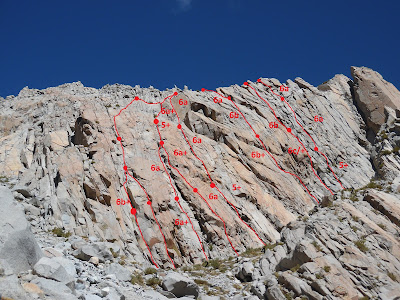
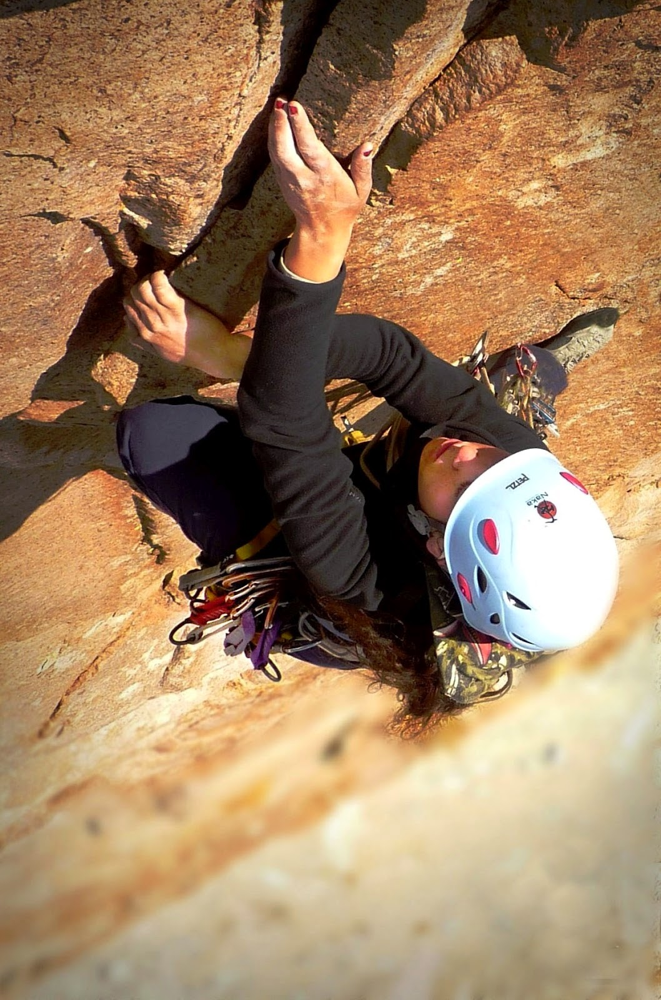

# Aguja: MURALLA DEL MISIL

**URL blog:** https://escaladaensosneado.blogspot.com/2014/10/aguja-muralla-del-misil.html
**Publicado:** Octubre 2014 | **Autor:** Lucas Alzamora

---

## Descripción General

"La muralla del misil es una gran placa vertical con fisuras y líneas de excelente calidad. La misma se encuentra inmediatamente a la izquierda de la cabeza del misil; incluso si continuamos por la cresta de la muralla podremos llegar a la cumbre del misil."

Quedan por abrir otras rutas de dificultad alta y sostenida.

**Aproximación:** Similar a "El Misil" (cara norte), continuando metros por el "gran acarreo" hasta el siguiente canal que baja a la derecha. **Tiempo: ~2 horas.**

---

## Imágenes

URLs originales:
- https://blogger.googleusercontent.com/img/b/R29vZ2xl/AVvXsEjLextCuTtgIBxIlHQzTsSI97rtq9nx8jf_DQ6zwje5xPwTLQca2ztPY6IJQtf8kLhHeWv5g0nNu3WAHF6i8NbR9HocoSRuNNByOsdAWJ5GfWdmzWl_bCSgpsIAsGepzPBX8GC74m48Bc7D/s400/SAM_0051.JPG
- https://blogger.googleusercontent.com/img/b/R29vZ2xl/AVvXsEhIgGxB5PiXpq2F9sQF7CUZc9kO-3Zd..../s1600/croq.jpg

---

## Vías

### Vía 1: "TAPÁNDOLE LA BOCA A ZANATTA" ⭐⭐⭐
- **Largo total:** 160 metros
- **Grado:** 6b+
- **Primer ascenso:** Carloncho Guerra y Macu Zanotti (02 Septiembre 2011)
- **Nota:** Primera línea identificada a la izquierda mirando la pared.

**Material:** 2 cuerdas de 50m, 1 juego completo de camalots, empotradores, material para reunión, cintas largas y mosquetones varios.

**Bajada:** 1 rappel (chapa con argolla) sobre la cara opuesta (sur), al final del gran diedro. Descender por acarreos, rodear la aguja hasta el pie de vía o bajar directo al "gran acarreo".

---

### Vía 2: "TOLITA" ⭐⭐⭐
- **Largo total:** 90 metros
- **Grado:** 6a+
- **Primer ascenso:** Lucas Alzamora, Maru Criscuolo y Nico Zabella (25 Marzo 2016)
- **Nota:** Variante para los primeros largos de "Burilador precoz". Comienza en el gran canal izquierdo de la pared.

| Largo | Metros | Grado | Descripción |
|-------|--------|-------|-------------|
| 1° | 50m | 6a+ | Buscar secciones con mejor fisura sobre la izquierda del canal hasta reunión cómoda. |
| 2° | 40m | 6a | Escalar hacia el canal mismo, reunión dentro de gran hueco. (A partir de aquí se une a "Burilador...") |

**Material:** 2 cuerdas de 60m, 1 juego completo de camalots, empotradores, material para reunión, cintas largas y mosquetones varios.

**Bajada:** 1 rappel (chapa con argolla) sobre cara opuesta (sur), final del gran diedro.

---

### Vía 3: "BURILADOR PRECOZ" ⭐⭐⭐
- **Largo total:** 175 metros
- **Grado:** 6a+
- **Primer ascenso:** Lucas Alzamora y Viri Bovo (02 Septiembre 2011)

Gran fisura-chimenea visible en la parte izquierda de la pared. La vía comienza 20m a la derecha de esta chimenea.

| Largo | Metros | Grado | Descripción |
|-------|--------|-------|-------------|
| 1° | 50m | 6a | Fisuras angostas conducen a pequeño techo, superado por derecha. Fisura paralela a chimenea que se ensancha. Reunión en repisa angosta. |
| 2° | 35m | 6a+ | Fisura se angosta, requiere protecciones pequeñas y escalada delicada. Pequeño techo con buenos agarres. Fisura izquierda lleva a gran hueco dentro de la chimenea para reunión cómoda. |
| 3° | 35m | 5+ | Escalada en chimenea que se angosta. Reunión bajo gran arbusto que corta paso. |
| 4° | 55m | 6a+ | Evitar arbusto por fisura derecha, volver a línea. Fisura cómoda de mano deposita en sistema de fisuras oblicuos por la cresta de la aguja. Reunión encima del diedro de "Esa aguja..." o metros abajo en chapa rappel. ⚠️ Estirar con cintas para evitar rozamiento. |

**Material:** 2 cuerdas de 60m, 1 juego completo de camalots, empotradores, material para reunión, cintas largas y mosquetones varios.

**Bajada:** 1 rappel (chapa con argolla) sobre cara opuesta (sur), final gran diedro.

---

### Vía 4: "ESA AGUJA NO TIENE FISURA" ⭐⭐⭐
- **Largo total:** 110 metros
- **Grado:** 6a
- **Primer ascenso:** Seba Vergara, Pela Lopez y Tincho Blando (Abril 2009)
- **Nota:** "Línea más evidente de toda la pared. Comienza casi en el centro y al final se ve un perfecto diedro en forma de libro abierto."

| Largo | Metros | Grado | Descripción |
|-------|--------|-------|-------------|
| 1° | 55m | 5+ | Comienza en diedro fisura, luego busca línea más evidente inclinándose levemente a la izquierda. Reunión en clavo. (1 clavo) |
| 2° | 55m | 6a | Fisuras netas pasando junto a gran bloque empotrado, continúa directo al gran diedro. Escalada hasta salir al filo. Chapa con argolla para descenso metros más abajo. |

**Material:** 2 cuerdas de 60m, 1 juego completo de camalots, empotradores, material para reunión, cintas largas y mosquetones varios.

**Bajada:** 1 rappel (chapa con argolla) sobre cara opuesta (sur), final gran diedro.

---

### Vía 5: "LOS DESHOLLINADORES DE HOLLYWOOD" ⭐⭐⭐
- **Largo total:** 140 metros
- **Grado:** 6b+
- **Primer ascenso:** Lucas Alzamora, Carloncho Guerra y Esteban Miguel (10 Noviembre 2016)
- **Nota:** "Excelente ruta para los amantes de las fisuras anchas." Comienza bajo techos esquivados por izquierda, buscando conectar el canal-fisura evidente de la izquierda.

| Largo | Metros | Grado | Descripción |
|-------|--------|-------|-------------|
| 1° | 55m | 6b+ | Escalada técnica con empotres complicados, usando el cuerpo entero. Escalada máxima metros en canal hasta reunión cómoda. |
| 2° | 55m | 6b | Sistema de fisuras evidente subiendo directo. Pasaje a fisura derecha, volviendo izquierda metros arriba. Reunión en terraza pequeña y cómoda. |
| 3° | 30m | 6a | Largo corto fácil al filo, travesía buscando rappeles. |

**Material:** 2 cuerdas de 60m, **2 juegos completos de camalots (incluyendo #4 y #5)**, empotradores, material para reunión, cintas largas y mosquetones varios.

**Bajada:** A derecha del final de vía, chapas rappeles de "Camarero...". 2 rappeles sobre chapas.

---

### Vía 6: "CAMARERO DESENCAMARONAMELO" ⭐⭐⭐
- **Largo total:** 120 metros
- **Grado:** 6c/+
- **Primer ascenso:** Lucas Alzamora y Carloncho Guerra (10 Noviembre 2016)
- **Nota:** "Otra gran ruta de esta hermosa pared."

| Largo | Metros | Grado | Descripción |
|-------|--------|-------|-------------|
| 1° | 60m | 6c/+ | Pequeño diedro de fisura muy fina bajo pequeño techo. Parte más difícil: pasos atléticos con talón para superar techo. Lo que sigue más fácil en buenas fisuras. Chapas en reunión. |
| 2° | 60m | 6b | Pequeño techo fácil de evitar por izquierda. Conectar sistema de fisuras evidentes que se ensanchan. Parte más dura del largo. Reunión metros arriba. |

**Material:** 2 cuerdas de 60m, 2 juegos completos de camalots (incluyendo medidas pequeñas), empotradores, material para reunión, cintas largas y mosquetones varios.

**Bajada:** 2 rappeles sobre chapas por la línea de ascenso.

---

### Vía 7: "EL ASOMISTA" ⭐⭐⭐
- **Largo total:** 120 metros
- **Grado:** 6a
- **Primer ascenso:** Lucas Alzamora, Roberto Rivas y Willy Hubeli (14 Febrero 2016)
- **Nota:** "La ruta más fácil de la Muralla. Una línea evidente que va buscando la conexión entre grietas siempre bien protegibles." Casi al final de la pared del lado derecho, llegando a la pared del misil.

| Largo | Metros | Grado | Descripción |
|-------|--------|-------|-------------|
| 1° | 50m | 5+ | Escalones fisurados con pasos técnicos, buscando derecha un lugar cómodo para reunión. |
| 2° | 40m | 6a | Sistemas de fisuras netos con pasajes técnicos. Repisa cómoda para reunión. |
| 3° | 30m | 6a | Largo más corto, escalada entre bloques buscando salida al filo. Reunión en el filo. |

**Material:** 2 cuerdas de 60m, 2 juegos completos de camalots, empotradores, material para reunión, cintas largas y mosquetones varios.

**Bajada:** Escalar izquierda por el filo ~20m hasta rappeles de "Camarero...". 2 rappeles sobre chapas.

---

## Descripción Original

La muralla del misil es la gran pared que se extiende a la izquierda de la aguja el misil, hacia el noreste. Esta formada por varias agujas menores que juntas forman una muralla bastante imponente. A diferencia del misil, aqui la roca no es tan perfecta pero la escalada es igual de buena, siempre sobre sistemas de fisuras.

Aproximación: la misma que para "La manteca" en el misil pero llegando al gran acarreo, en vez de girar a la derecha, continuamos recto hasta la base de la muralla. Tiempo: 1,30hs a 2hs aprox.

Vía: "En el principio", 240mts, 6b, ****
(Lucas Alzamora y Diego Nakamura, Agosto 2009)

La vía mas larga de la muralla. Comienza en la parte izquierda de la pared, sobre la base de un gran diedro que es inconfundible. Largo 1: escalada fácil hasta la base del diedro. Largo 2: el gran diedro, escalada sostenida de fisura-diedro con buen material. Largos 3-5: seguir por el sistema de fisuras hasta la cumbre.

Vía: "Prometo no volver", 180mts, 6b+, ****
(Lucas Alzamora y Diego Nakamura, Septiembre 2009)

Vía: "El pájaro carpintero", 100mts, 6b, ***
(Lucas Alzamora y Diego Nakamura)

Vía: "La chancha", 120mts, 6a+, ***

Vía: "Bajo presión", 80mts, 6c, ***

Vía: "Fisura Mac", 60mts, 6b, ***

Vía: "Crack del tiempo", 80mts, 6b+, ***
