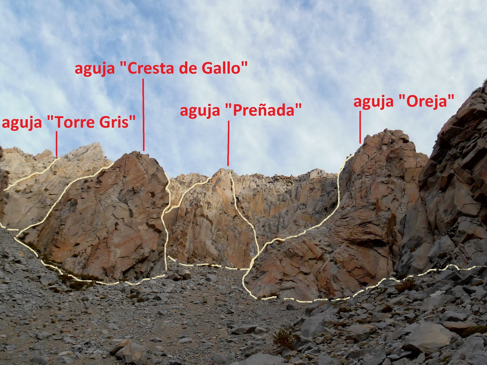
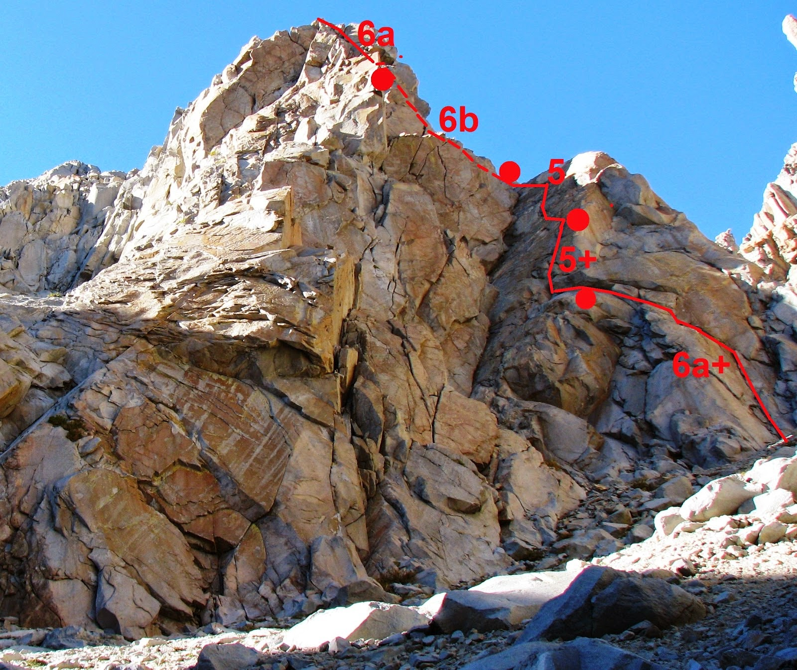

# Aguja: OREJA

**URL blog:** https://escaladaensosneado.blogspot.com/2014/10/aguja-oreja.html
**Publicado:** Octubre 2014 | **Autor:** Lucas Alzamora

---

## Descripción General

"La Oreja es una aguja fácilmente visible una vez que comenzamos a subir por el gran acarreo" que conduce a las agujas del circo superior. Se caracteriza por un **gran bloque rectangular en el centro de la pared que asemeja a una oreja cuando se ve de costado**.

**Aproximación:** La misma que para El Misil y El Champiñón pero seguir subiendo varios metros por el gran acarreo hasta el fondo del mismo. **Tiempo: ~2:30 horas.**

---

## Imágenes

URLs originales:
- https://blogger.googleusercontent.com/img/b/R29vZ2xl/AVvXsEi0FpPFpWiHJHBz1WkXR5JDBWvoTRln4NoVXnyclQdXJ6NKwa0i0eVu6Im274yI59ghrNxl_GxcvPJ_ZHeBVyPCb2WHQDoLdpIPFIwoFpzZxrGjGgl-a7XX9YjgrAO6NVj38N8S9GQOKkgu/s1600/SAM_2934.JPG
- https://blogger.googleusercontent.com/img/b/R29vZ2xl/AVvXsEgSsZ9292LsTttoVEvh1UuGUTVszjgg36L8n-4yWoCAl5ly4qvnuHdC2AQ4E_-pUWCAtRihJm2_mOMQK79DtVIYbRsJVE8CctoP9AJrTXylGiyUy5JyX8ULkabBM6n-W7tXIcERM0BUfOiD/s1600/or.JPG

---

## Vías

### Vía 1: "SÓLIDAS MURALLAS" ⭐⭐⭐
- **Largo total:** 270 metros
- **Grado:** 6b
- **Primer ascenso:** Lucas Alzamora y Maxi Astete Millan (Diciembre 2008)

| Largo | Metros | Grado | Descripción |
|-------|--------|-------|-------------|
| 1° | 50m | 6a+ | Sistema de fisuras que giran a la izquierda, pasando bajo pequeños techos y pasos de bloque. (1 chapa con argolla) |
| 2° | 50m | 5+ | Gran placa con pequeño resalte semi-desplomado. Línea central. (1 chapa con argolla) |
| 3° | 50m | 5° | Fisuras netas y fáciles hasta donde concluye la placa. (1 chapa con argolla) |
| 4° | 45m | 6b | Diedro perfecto cortado por techo — **pasos atléticos**. (2 chapas) |
| 5° | 50m | 6a | Sistema de fisuras de manos deposita en bloques de cumbre. (2 chapas) |
| 6° | 25m | 3° | Bloques de cumbre sin asegurar. |

**Material:** 2 cuerdas 50m, camalots hasta #3 (repetidos #1 y #2), empotradores, material reunión, cintas largas.

**Bajada:** 5 rappeles por la misma línea de subida.

---

### Vía 2: "EFECTO VENTURI" ⭐⭐⭐⭐
- **Largo total:** 200 metros
- **Grado:** 6c
- **Primer ascenso:** Lucas Alzamora y Diego Nakamura (Mayo 2018)

| Largo | Metros | Grado | Descripción |
|-------|--------|-------|-------------|
| 1° | 55m | 6b | Fisuras que se pierden intermitentemente. Diedro angosto con fisura fina. Pasos duros. |
| 2° | 45m | 6a | Fisuras buenas, escalada a izquierda de gran placa. Canal fácil. |
| 3° | 40m | 6c | "Gran placa zurcada por dos evidentes sistemas de fisuras." Línea izquierda con buenos empotres de puño, dúlfer exigente sobre borde romo. |
| 4° | 60m | 6a | Conexión entre sistemas de fisuras. Travesía hacia izquierda. Se une con "Sólidas Murallas". (2 chapas) |

**Material:** 2 cuerdas 60m, 2 juegos camalots hasta #3, material reunión, cintas largas.

**Bajada:** Rappeles de "Sólidas Murallas".

---

## Descripción Original

La oreja es una aguja fácilmente visible una vez que comenzamos a subir por el "gran acarreo", el que conduce a todas las agujas del circo superior. Este canal se podría decir que termina en la base de "la oreja", aunque luego salen otros acarreos que nos conducen a otras agujas esta cierra parcialmente la visión del circo desde abajo. Desde este punto tendremos a nuestra izquierda el canal de la "cresta y "torre gris" y a la derecha los canales que llevan a "la nápia", "alfeñique", "gran torre", etc. La reconoceremos también por un gran bloque rectangular en el centro de la pared que visto de costado asemeja a una oreja y da nombre a la aguja.

Aproximación: La misma que para "el misil" y "champiñón" pero seguimos subiendo varios metros por el "gran acarreo" hasta el fondo del mismo.
Tiempo: 2,30hrs aprox.

Vía: "Sólidas murallas", 270mts, 6b, ***
(Lucas Alzamora y Maxi Astete Millan, diciembre de 2008)

A la derecha del pilar central (bloque) que forma la oreja, veremos una gran placa inclinada, en la base de las mismas pero unos metros mas a la derecha comienza un interesante sistema de netas fisuras que van girando a la izquierda, pasando por debajo de unos pequeños techos y unos pasos de bloque. Debajo del sistema de fisuras que baja de la gran placa encontraremos la primer reunión (Largo 1°: 50mts, 6a+, 1 chapa con argolla). Nos metemos ya en la gran placa, tras superar un pequeño resalte semi desplomado pero con buenas fisuras, tomamos la línea central que surca toda la placa, y a mitad de la misma encontraremos la segunda reunión (Largo 2°: 50mts, 5+, 1 chapa con argolla). Continuamos por las fisuras netas y fáciles de la gran placa hasta donde concluye la misma, unos metros a la izquierda surge un canal por donde continua la vía y encontraremos la reunión siguiente (Largo 3°: 50mts, 5°, 1 chapa con argolla). Aquí comienzan una serie de virajes para ir buscando la cumbre, primero salimos de la reunión recto para arriba en busca de un diedro perfecto cortado por un techo, unos pasos atléticos nos hacen recorrer el mismo por debajo y hacia la izquierda donde tras asomarnos a una pequeña repisa encontraremos la reunión (Largo 4°: 45mts, 6b, 2 chapas). Saliendo de la reunión, apenas a unos metros a nuestra izquierda comienza un neto sistema de fisuras de manos y por tramos un poco mas ancho. Lo recorremos hasta el final y este nos deposita en los bloques de la cumbre donde encontraremos la reunión (Largo 5°: 50mts, 6a, 2 chapas). Aquí podemos seguir sin asegurar hasta la mas alta de las 3 cumbres (Largo 6°: 25mts, 3°).

Equipo: 2 cuerdas de 50mts, 1 juego completo de camalots hasta el #3 y con el #1 y #2 repetidos, algunos empotradores, material para reunión, cintas largas y mosquetones varios.
Bajada: por la misma línea de subida mediante 5 rappeles.

Vía: "Efecto venturi", 200mts, 6c, ****
(Lucas Alzamora y Diego Nakamura, mayo de 2018)

Una ruta con largos de excelente calidad!! La ruta comienza justo en la base del canal central de la pared, encima nuestro tendremos la gran proa que forma la característica oreja que da nombre a la aguja.
El primer largo no es muy evidente ya que las fisuras por momento se van perdiendo y tenemos que buscar las conexiones entre una y otra, casi siempre sobre nuestra izquierda. Los últimos metros nos introducen en un diedro angosto, con fisura fina, donde encontramos los pasos mas duros del largo. Justo encima del mismo encontramos una plataforma cómoda para montar la reunión. (Largo 1°: 55mts, 6b). El segundo largo nos lleva por fisuras buenas pero de menor dificultad. Siempre escalando a la izquierda de una gran placa con una pequeña linea de fisura. Nos introducimos en un canal fácil que nos deposita en la base de la gran placa del tercer largo. En la misma montamos la reunión. (Largo 2°: 45mts, 6a). El tercer largo es una verdadera joya de la escalada en sosneado!!! Una gran placa, surcada por dos evidentes sistemas de fisuras. La linea toma la fisura de la izquierda, fácil en un principio y luego va poniéndose cada vez más ancha y exigente. La sección clave es una sucesión de buenos empotres de puño, o un dúlfer exigente sobre un borde romo... siempre escalamos con el gran pilar que forma "la oreja" a nuestra izquierda. En la parte final de la placa se encuentra una cómoda repisa donde montamos la reunión. (Largo 3°: 40mts, 6c). El cuarto largo es algo complejo de describir ya que va buscando la conexión entre un sistema de fisuras y otro. En principio nos vamos para la derecha, luego con una pequeña travesía hacia la izquierda conectamos otro sistema y finalmente recto hacia la parte alta de un pequeño pilar donde encontramos una reunión que pertenece a la vía "solidas murallas", a partir de ahí las vías se unen. (Largo 4°: 60mts, 6a, 2 chapas)

Equipo: 2 cuerdas de 60mts, 2 juegos completos de camalots hasta el #3, material para reunión, cintas largas y mosquetones varios.
Bajada: por la misma línea de rappeles de "solidas murallas".
