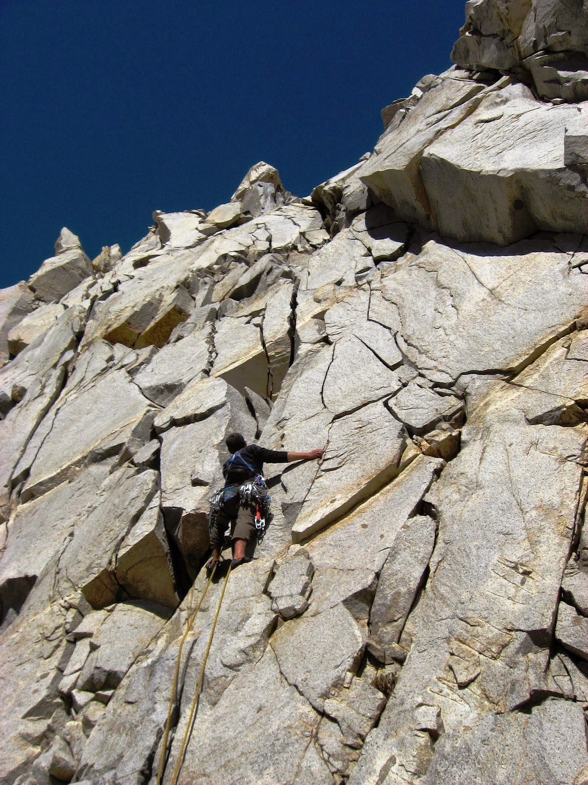
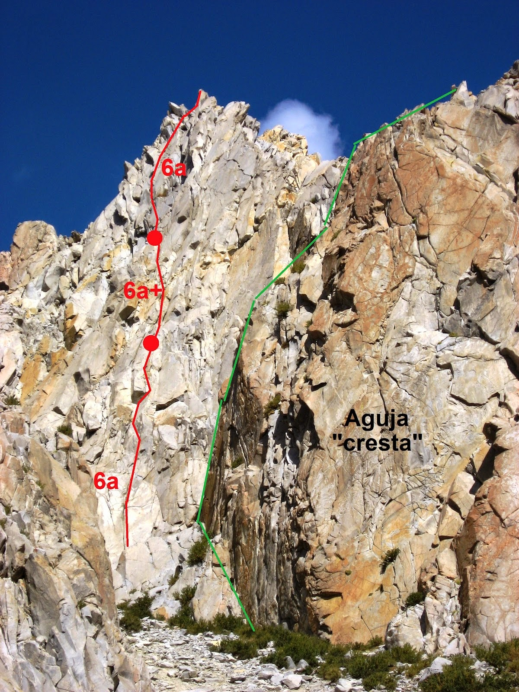

# Aguja: TORRE GRIS

**URL blog:** https://escaladaensosneado.blogspot.com/2014/10/aguja-torre-gris.html
**Publicado:** Octubre 2014 | **Autor:** Lucas Alzamora

---

## Descripción General

"Aguja que cuenta con una sola vía hasta el momento pero que puede convertirse en una clásica por lo accesible de sus largos y lo agradable de su escalada. La aguja no es muy evidente ya que se encuentra tapada por la Cresta de Gallo."

**Aproximación:** La misma que para la Cresta de Gallo pero continuando subiendo por el acarreo que pasa a la izquierda de ésta. Unos metros más arriba se llega a la base de la Torre. **Tiempo: ~2:30 horas.**

---

## Imágenes

URLs originales:
- https://blogger.googleusercontent.com/img/b/R29vZ2xl/AVvXsEilslitPHxCrhVNmCVGz5zxQLSHp2xNQZqNmV3DzXSK-x4gieb9XGlLlYgdbfryIj3l48Onrv-kppKDM9v6SUBvsBB-4PbGWtk8azjBVKfL2IWeyWg8dDHjKBzllzSDmVyfNHZjpvnQozni/s1600/gris.JPG
- https://blogger.googleusercontent.com/img/b/R29vZ2xl/AVvXsEjEFwRkxEx3P97SinjOIBf7nUUvkjoVmKqfukmLDXepMoNIJNd0WKyZyCEXAN90A9QBTAoREafPsPUkSXYRHwiAlvuGfqWCddbj76myjQzy4EYLa9mCqous34ZHCpKY15VcNi6Wj5HmEbf7/s1600/gr.JPG

---

## Vías

### Vía 1: "ZUMO PASCUAL" ⭐⭐⭐
- **Largo total:** 140 metros
- **Grado:** 6a+
- **Primer ascenso:** Lucas Alzamora y Diego Nakamura (29 de Mayo 2009)

| Largo | Metros | Grado | Descripción |
|-------|--------|-------|-------------|
| 1° | 40m | 6a | Pequeño canal, plataforma con fisuras, primeros diedros pequeños. |
| 2° | 35m | 6a+ | Diedros sucesivos, col o abra con reunión. |
| 3° | 50m + 15m | 6a + 3° | Placa con múltiples fisuras hacia la cumbre. Los últimos 15m son de 3° grado hasta la cumbre. |

**Material:** 1 juego completo de camalots, 1 juego de empotradores, 2 cuerdas de 50m, material para reunión, cintas largas y mosquetones varios.

**Bajada:** Por la misma línea de subida.
- 1° rappel desde un bloque (natural) hasta el col.
- 2° rappel desde el col hasta mitad de pared mediante otro rappel natural.
- En mitad de pared encontrar 1 clavo y un cordín a un bloque. Desde ahí llegar al suelo.

---

## Descripción Original

Aguja que cuenta con una sola vía hasta el momento pero que puede convertirse en una clásica por lo accesible de sus largos y lo agradable de su escalada. La aguja no es muy evidente ya que se encuentra tapada por la "cresta de gallo".

Aproximación: La misma que para la "cresta" pero continuamos subiendo por el acarreo que pasa a la izquierda de esta última, unos metros mas arriba llegamos a la base de la torre.
Tiempo: 2,30hs aprox.

Vía: "Zumo Pascual", 140mts, 6a+, ***
(Lucas Alzamora y Diego Nakamura, 29 de mayo de 2009)

De la base de la pared, subimos unos metros por un pequeño canal a la derecha que nos deja en una plataforma con fisuras evidentes y nos permite apreciar unos metros mas arriba la sucesión de pequeños diedros por donde transcurre la vía. Vamos escalando por fisuras fáciles hasta toparnos con el primero de los pequeños diedros, con escalada delicada lo superamos y montamos reunión donde encontremos un sitio cómodo (Largo 1°: 40mts, 6a). Continuamos por el mismo sistema de diedros superando el mas difícil justo por encima de la reunión, después de esto y tras varios metros de escalada encontramos una especie de col o abra, donde montamos la reunión sobre buenas fisuras y con el ultimo largo y la torre final a la vista (Largo 2°: 35mts, 6a+). La placa que sigue esta surcada por varias fisuras, todas excelentes y disfrutables, de todos los tamaños, buscamos la mas cómoda que va por el centro de la pared y nos lleva directo a la cumbre (Largo 3°: 50mts, 6a, mas 15mts de 3° grado hasta la cumbre).

Equipo: 1 juego completo de camalots, un juego de empotradores, 2 cuerdas de 50mts, material para reunión, cintas largas y mosquetones varios.
Bajada: Por la misma línea de subida. Primero un rappel desde un bloque (natural) hasta el col, otro desde aquí hasta mitad de pared mediante otro rappel natural. En mitad de pared encontraremos 1 clavo y un cordín a un bloque, de aquí ya llegamos al suelo.
