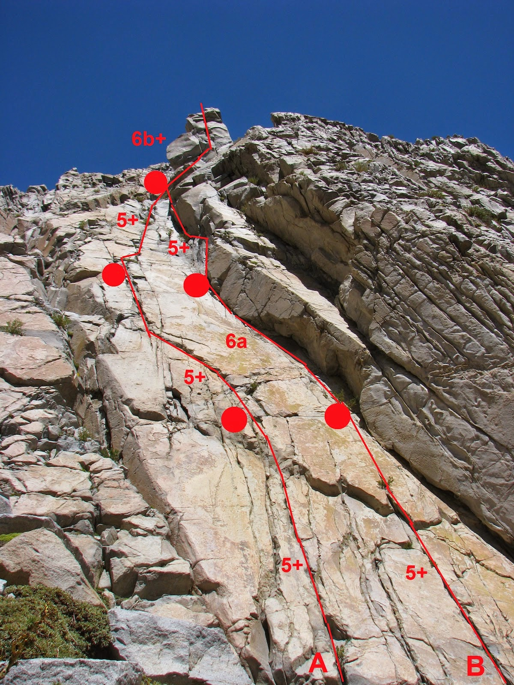
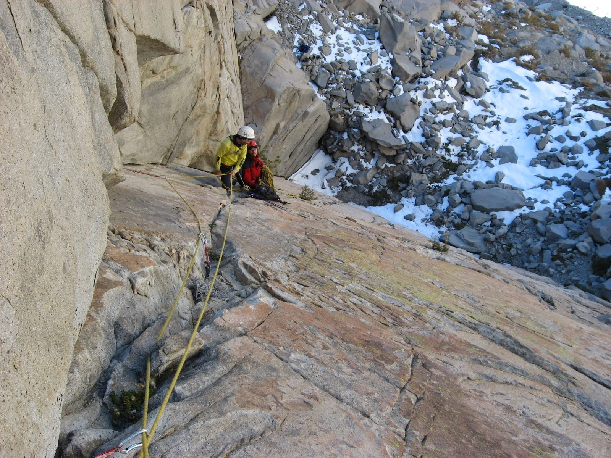

# Aguja: EL CHAMPIÑÓN

**URL blog:** https://escaladaensosneado.blogspot.com/2014/10/aguja-el-champinon.html
**Publicado:** Octubre 2014 | **Autor:** Lucas Alzamora

---

## Descripción General

Pequeña aguja con rutas de escalada de buena calidad ubicada **detrás de la Muralla del Misil**. Se distingue por un gran diedro a la derecha y un **bloque fisurado dividido en dos en la cumbre** que le da el nombre.

**Aproximación:** Igual que para El Misil (cara norte) y Muralla del Misil, continuando por el "gran acarreo" unos metros más, justo detrás de la muralla. **Tiempo: ~2:15 horas.**

---

## Imágenes

URLs originales:
- https://blogger.googleusercontent.com/img/b/R29vZ2xl/AVvXsEihoB4t20LFyAxHkdW5Ko0zj_3P7oglWg_pXGoe8VOUqC3S5uW3sAkgp4VmerhqwIvsSfSRvJDLztRvi2-_SgSg2mJyUhyjxQ00XtLIZcweGqMkpK6c0gTqcWI0x8P-M9NtZts1PZXshAMV/s1600/cha.JPG
- https://blogger.googleusercontent.com/img/b/R29vZ2xl/AVvXsEjIdWCt8DVRPLT2cQobbeHNRJefhG78evqEqiAySkMDeTBvpMkfMFIixoJIb9i_lNoVjAGxgvhUxbfrWL4t-K-KTnq6lFhb6yN1zKemIVK6T4K54P-bIRtkYL0yDqPCcTUDZfeZOsF90UMi/s1600/IMG_5532.JPG

---

## Vías

### Vía 1: "LA VEDETTE" ⭐⭐⭐
- **Largo total:** 135 metros
- **Grado:** 6b+
- **Primer ascenso:** Lucas Alzamora, Diego Nakamura y Maxi Astete Millán (01 de Mayo 2008)

| Largo | Metros | Grado | Descripción |
|-------|--------|-------|-------------|
| 1° | 40m | 5+ | Comienza metros a la izquierda del gran diedro gris. Sistema de fisuras fáciles acercándose progresivamente al diedro. Pequeño resalte en forma de techo. (1 clavo + 1 stopper) |
| 2° | 40m | 6a | Fisuras finas técnicas con protecciones delicadas. Se entra al gran diedro donde las fisuras son más escalables. Reunión sobre pequeña plataforma. |
| 3° | 30m | 5+ | Continuación por el diedro aprovechando fisuras a la izquierda. Sale a gran repisa debajo del bloque de cumbre. |
| 4° | 25m | 6b+ | **Bloque escalado por la izquierda.** Fisura que lo parte en dos, se abre progresivamente transformándose en amplio **offwidth** hasta la cumbre. |

**Material:** 2 cuerdas de 50m, 1 juego completo de camalots, empotradores pequeños, **1 camalot #5 para el largo final**, material para reunión, cintas largas y mosquetones varios.

**Bajada:** 3 rappeles:
- 2 primeros sobre bloques con cintas naturales
- Último desde reunión nº1 con 1 clavo y 1 stopper
- O destrepar hacia canal sur con cuidado.

---

### Vía 2: "CON LAS PLUMAS Y EN PELOTAS" ⭐⭐⭐
- **Largo total:** 135 metros
- **Grado:** 6b+
- **Primer ascenso:** Lucas Alzamora, Diego Nakamura y Maxi Astete Millán (08 de Diciembre 2008)

| Largo | Metros | Grado | Descripción |
|-------|--------|-------|-------------|
| 1° | 40m | 5+ | Sistema de fisuras a la izquierda de "La Vedette", centro de la pared. Superposición de buenas fisuras a pequeña repisa. |
| 2° | 40m | 5+ | Continuación por mismo sistema llevando hacia la derecha de la pared, acercándose a "La Vedette". Reunión sobre pequeña repisa. |
| 3° | 30m | 5+ | Línea evidente acercándose al gran diedro. Reunión en mismo punto que "La Vedette". **Continúa con el mismo 4° largo hacia la cumbre.** |

**Material:** 2 cuerdas de 50m, 1 juego completo de camalots, empotradores, **1 camalot #5 para el largo final**, material para reunión, cintas largas y mosquetones varios.

**Bajada:** 3 rappeles, igual que "La Vedette".

---

## Descripción Original

Una pequeña aguja pero con rutas de escalada de muy buena calidad, que se encuentra justo detrás de la muralla del misil, en el siguiente canal. Es fácil de distinguir por un gran diedro a la derecha de la pared y un curioso bloque fisurado, partido en dos, que se encuentra en su cumbre y da nombre a la aguja.

Aproximación: La misma que para el misil (cara norte) y muralla del misil, pero continuando por el "gran acarreo" unos metros mas, se encuentra justo detrás de la muralla del misil (por donde rappelamos).
Tiempo: 2, 15hs aprox.

Vía: "La vedette", 135mts, 6b+, ***
(Lucas Alzamora, Diego Nakamura y Maxi Astete Millan, 01 de mayo de 2008)

Esta es la primer vía abierta en la aguja por lo que encontraremos algunas reuniones montadas. La misma comienza unos metros a la izquierda del gran diedro gris que marca el límite de la aguja. Escalamos un sistema de fisuras fáciles que de a poco se van acercando a la ancha fisura del diedro gris. Tras superar un pequeño resalte en forma de techo encontramos la primer reunión (Largo 1°: 40mts, 5+, 1 clavo y 1 stopper). Saliendo de la reunión nos montamos en unas fisuras finas, técnicas y con protecciones delicadas, unos metros mas arriba nos metemos directamente en el gran diedro donde las fisuras ya son mas escalables y protegibles, sobre una pequeña plataforma montamos la reunión (Largo 2°: 40mts, 6a). Continuamos por el diedro y también aprovechamos algunas fisuras a nuestra izquierda hasta salir a una gran repisa justo debajo del bloque de cumbre y donde armamos la siguiente reunión (Largo 3°: 30mts, 5+). Enfrentamos el bloque por la izquierda y luego nos metemos de lleno en la fisura que lo parte en dos y que se va abriendo a medida que progresamos hasta transformarse en un amplio offwidth y nos deposita en la cumbre (Largo 4°: 25mts, 6b+).

Equipo: 2 cuerdas de 50mts, 1 juego completo de camalots, algunos empotradores pequeños y 1 camalot #5 para el largo final, material para reunión, cintas largas y mosquetones varios.
Bajada: podemos bajar por la misma vía mediante 3 rappeles, los 2 primeros sobre bloques con cintas (naturales) y el ultimo desde la reunión n°1 (1 clavo y 1 stopper), o bien destrepar hacia el canal detrás de la aguja (sur) con mucho cuidado.

Vía: "Con las plumas y en pelotas", 135mts, 6b+, ***
(Lucas Alzamora, Diego Nakamura y Maxi Astete Millan, 08 de diciembre de 2008)

Comenzar escalando por el sistema de fisuras que se encuentra a la izquierda de la vía "La vedette", justo en el centro de la pared. Una superposición de buenas fisuras nos llevan directo a una pequeña repisa donde montamos la primer reunión (Largo 1°: 40mts, 5+). Continuamos por el mismo sistema de fisuras que nos va llevando a la derecha de la pared, acercándose a la vía anteriormente descripta. Sobre otra pequeña repisa encontramos un buen lugar para culminar el largo y montar la reunión (Largo 2°: 40mts, 5+). Siguiendo la línea evidente nos acercamos al gran diedro y montamos la reunión en el mismo punto que la vía "la vedette" y a partir de aquí continuamos con el mismo largo para llegar a la cumbre. (Largo 3°: 30mts, 5+)

Equipo: 2 cuerdas de 50mts, 1 juego completo de camalots, algunos empotradores y 1 camalot #5 para el largo final, material para reunión, cintas largas y mosquetones varios.
Bajada: podemos bajar por la misma vía mediante 3 rappeles, los 2 primeros sobre bloques con cintas (naturales) y el ultimo desde la reunión n°1 (1 clavo y 1 stopper), o bien destrepar hacia el canal detrás de la aguja (sur) con mucho cuidado.
