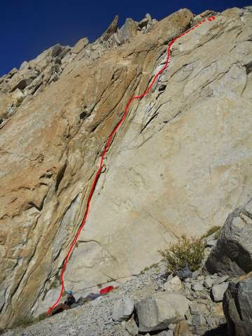

# Aguja: CARLITOS Y CASSATA

**URL blog:** https://escaladaensosneado.blogspot.com/2014/10/aguja-carlitos-y-cassata.html
**Publicado:** Octubre 2014 | **Autor:** Lucas Alzamora

---

## Descripción General

**"Aguja con buenas características para realizar una iniciación de escalada en el valle, por su corto recorrido y grados accesibles en todos sus largos."**

**Aproximación:** La misma que para "El Misil" (cara norte). A la altura del canal de entrada de dicha aguja, tomar para la izquierda y por un acarreo fácil llegar a la base de la pared. **Tiempo: ~2 horas.**

---

## Imágenes

URL original:
- https://blogger.googleusercontent.com/img/b/R29vZ2xl/AVvXsEh-1zgygyRcWSQ5r5E8tkC7nrapUMnSkDmdO8w-LcWNv83iZgKge2g3TGSGCzZsH9qDDDUAxwazw1P116TFtSZdE6ewi6-9Iu2xmxTuocdjuRhu8mC4gg5GSph3DaDGS7f0X-hmE5jVOr3C/s1600/casata.jpg

---

## Vías

### Vía 1: "DESCENSO A CIEGAS" ⭐⭐
- **Largo total:** 90 metros
- **Grado:** 5+
- **Primer ascenso:** Carlos Cagnoli y Mario Nakagama (Abril 2008)

| Largo | Metros | Grado | Descripción |
|-------|--------|-------|-------------|
| 1° | 25m | 5+ | La vía discurre sobre la parte izquierda de la pared por fisuras evidentes. A los pocos metros se encuentra una amplia repisa donde se monta la reunión. |
| 2° | 60m | 5+ | "Tirada bien larga casi hasta la cumbre. Tras tramos de escalada accesibles, encontrar al final del largo un paso delicado." |
| 3° | 5m | 4° | "Estamos a metros de la cumbre y sobre terreno fácil, pero es aconsejable asegurar." |

**Material:** 2 cuerdas de 60m, 1 juego completo de camalots y algunos empotradores pequeños, cintas largas, material para reunión y mosquetones varios.

**Bajada:** Desde la cumbre, un rappel de 60m desde un bloque (natural) hacia la parte de atrás de la aguja (sur), luego destrepe hasta el "gran acarreo".

---

### Vía 2: "CASSATA" ⭐⭐⭐
- **Largo total:** 32 metros
- **Grado:** 6a+
- **Primer ascenso:** Fede Ruffini, Pablo Artigue, Santi y Jony

"Es un hermoso diedro de 32 metros... Está como aproximando al misil, pero antes de meterse en los canaletones. Son tres paredes super características por ser de roca de 3 colores distintos. Arriba pusieron 2 clavos (uno tipo U y uno plano)."

Un solo largo de 32m hasta la cumbre del pequeño diedro. Descenso en rappel por los mismos clavos.

---

## Descripción Original

Aguja con buenas características para realizar una iniciación de escalada en el valle, por su corto recorrido y grados accesibles en todos sus largos.

Aproximación: La misma que para "el misil" (cara norte). A la altura del canal de entrada de dicha aguja tomamos para nuestra izquierda y por un acarreo fácil llegamos a la base de la pared.
Tiempo: 2hs aprox.

Vía: "Descenso a ciegas", 90mts, 5+, **
(Carlos Cagnoli y Mario Nakagama, abril de 2008)

La vía discurre sobre la parte izquierda de la pared, por fisuras evidentes, a los pocos metros encontramos una amplia repisa donde montamos la reunión (Largo 1°: 25mts, 5+). A partir de aquí es una tirada bien larga casi hasta la cumbre, tras tramos de escalada accesibles encontraremos al final del largo un paso delicado. Luego de este montamos la reunión en una plataforma (Largo 2°: 60mts, 5+). De aquí estamos a metros de la cumbre y sobre terreno fácil pero es aconsejable asegurar (5mts, 4°).

Equipo: 2 cuerdas de 60mts, 1 juego completo de camalots y algunos empotradores pequeños, cintas largas, material para reunión y mosquetones varios.
Bajada: Desde la cumbre un rappel de 60mts desde un bloque (natural) hacia la parte de atrás de la aguja (sur), luego destrepe hasta el "gran acarreo".

Vía: "Cassata", 32mts, 6a+, ***
(Fede Ruffini, Pablo Artigue, Santi y Jony)

Es un hermoso diedro de 32 metros, para el que proponemos 6a+. Está como aproximando al misil, pero antes de meterse en los canaletones. Son tres paredes super características por ser de roca de 3 colores distintos. Arriba pusimos 2 clavos (uno tipo U y uno plano).
Info: Fede Ruffini
