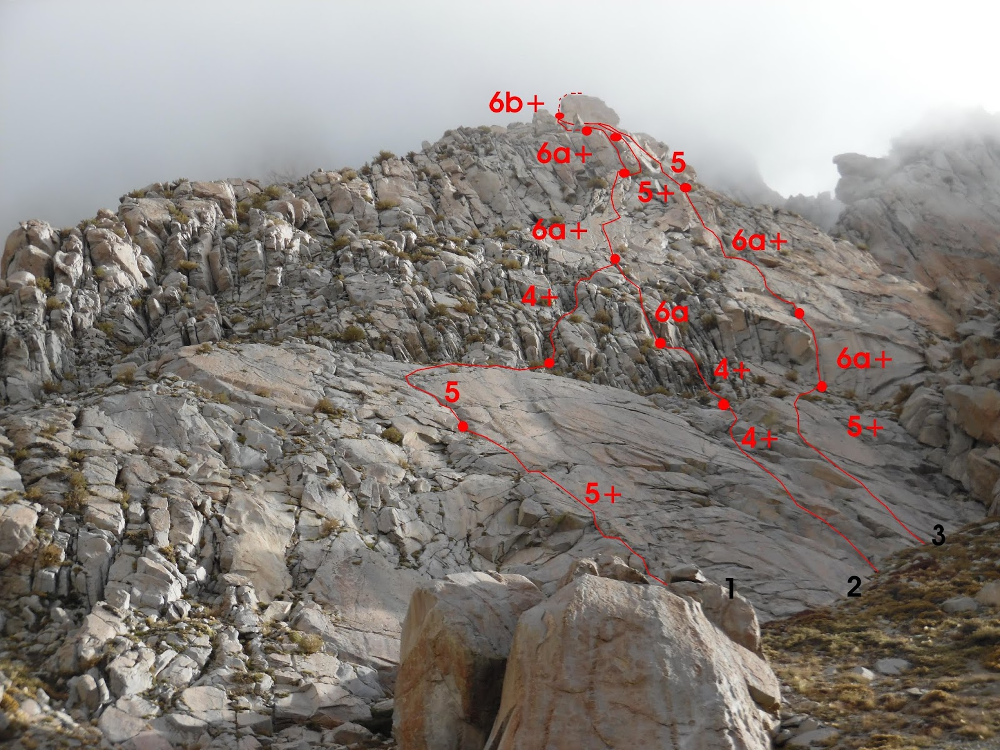
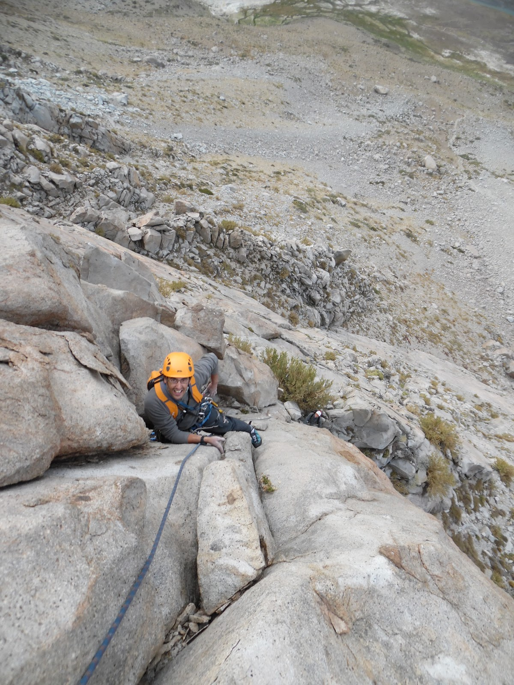

# Aguja: EL BOLILLO

**URL blog:** https://escaladaensosneado.blogspot.com/2014/10/aguja-el-bolillo.html
**Publicado:** Octubre 2014 | **Autor:** Lucas Alzamora

---

## Descripción General

"Una de las agujas más accesibles para quienes comienzan a escalar en el valle." Se caracteriza por su corta aproximación, escalada de dificultad media/baja, largo recorrido y descenso caminando.

"Una gran masa de roca, con secciones evidentes de placas en su comienzo y mitad de pared, y coronada por **una gran bola redonda de roca (bloque) que le da el nombre**."

**Aproximación:** Desde la zona de acampe, dirigirse noroeste por la meseta plana de bloques ~20 minutos. Pasar un gran acarreo de roca bajando del circo superior; inmediatamente después aparece la aguja con un gran bloque en la base sobre su izquierda. **Tiempo: ~40 minutos.**

---

## Imágenes

URLs originales:
- https://blogger.googleusercontent.com/img/b/R29vZ2xl/AVvXsEhE7kyavwrJBt7cyOP_2hZRt-a_ZDawn-aAgpOzm0zwK2N-SEs1i9aHFGFREp5Xo5mKGhUFB5nYW0pGfBT2DzhyphenhyphenE54D0AnYXEcA4Rg2exjqhmb8QpFF2BsCqQVyiYi_gbvCcRDbA3OTEZ8c/s1600/bolillo.JPG
- https://blogger.googleusercontent.com/img/b/R29vZ2xl/AVvXsEhpjLkV1EqRespKyeyHq1vHrJ0fH9ywutCxuKwcSzWOSg2-5SokaonAjhEd12ANMLO678Efk4PuKHD5pABKuR7QauldFeroNypkG1TcbLuSmW5VwUkI51Pz80jmUnivOH_8KcCJHcaxx0tM/s1600/SAM_0045.JPG

---

## Vías

### Vía 1: "GENTE BUENA SI LAS HAY" ⭐⭐⭐
- **Largo total:** 320 metros
- **Grado:** 6b+
- **Primer ascenso:** Lucas Alzamora, David Zalazar y Paula Señor (Febrero 2008)

| Largo | Metros | Grado | Descripción |
|-------|--------|-------|-------------|
| 1° | 40m | 5+ | Comienza por un diedro fisurado evidente, un poco a la izquierda de la pared y cerca del gran bloque de la base. Escalar el sistema diedro/fisura, pasarse a una angosta fisura encima de un techo y montar reunión en pequeña repisa. |
| 2° | 45m | 5° | Continuar por mismo sistema de fisura llevando un poco a la izquierda por una "fisura banana evidente desde la base de la pared". Llegar a cómoda repisa con grandes bloques para reunión. |
| 3° y 4° | 90m | 4+ | Dos largos fáciles buscando la pasada evidente entre los bloques, siempre en dirección hacia la derecha. Objetivo: base de gran placa con fisura oblicua que comienza recta y vira a la derecha. |
| 5° | 40m | 6a+ | Tomar la fisura oblicua de la placa que vira hacia la derecha. Fisura de manos con un poco de vegetación que luego se angosta hasta poder empotrar solo los dedos. Pies en adherencia. Repisa cómoda en base de diedro para reunión. |
| 6° | 40m | 6a+ | "Superar el diedro con escalada bastante atlética y continuar por zona de bloques más fáciles." Reunión. |
| 7° | 40m | 4+ | Dirigirse al gran bloque de la cumbre, rodearlo por la izquierda hasta encontrar una fisura neta con una chapa unos metros más arriba. |
| 8° | 30m | 6b+ | **El bloque cumbrero es la parte más difícil de la ascensión.** "Escalada atlética al principio y delicada en su parte final." Opción: descender destrepando desde antes sin escalar el bloque. (2 clavos) |

**Material:** 1 cuerda de 50m, un juego completo de camalots, algunos stoppers, cintas largas, mosquetones simples y material para reunión.

**Bajada:** De la cumbre, un corto rappel. Detrás de la pared bajar por el canal de la derecha o de la izquierda; ambos conducen a la meseta del campamento.

---

### Vía 2: "SILLITA DE CARNE" ⭐⭐⭐
- **Largo total:** 230 metros
- **Grado:** 6b+
- **Primer ascenso:** Lucas Alzamora y Diego Nakamura (10 de Diciembre 2011)

| Largo | Metros | Grado | Descripción |
|-------|--------|-------|-------------|
| 1° | 60m | 5+ | Escalada en la parte derecha de la placa inferior. Sube fácil hasta gran canal que se va cerrando. Montar por grandes bloques, atravesar hacia la derecha por una angosta repisa con vegetación, pasando por debajo de unos muros desplomados. |
| 2° | 30m | 6a+ | Donde terminan los desplomes, bien a la derecha de la pared, se forma un diedro con fisura angosta que se va tumbando levemente. "Fisuras delicadas con pequeños empotres, pies en adherencia o sobre pequeños huecos y regletas." Reunión en nicho grande y cómodo. |
| 3° | 50m | 6a+ | Salir directo a una fisura de dedos, luego pasarse a una gran laja a la izquierda. Continuar por excelentes sistemas de fisuras hacia un canal/chimenea con un arbusto en su parte final. Reunión en cómoda repisa. |
| 4° | 60m | 5° | A la izquierda nace un diedro de difícil protección; tomar sistema de fisuras más fácil encima de la reunión. Buscar la base de la cumbre hacia la izquierda. |
| 5° | 30m | 6b+ | Escalar bloques fáciles (4+) y rodear la cumbre por la izquierda hasta la base. Escalar la única fisura que parte el bloque cumbrero. Chapa a 10m. "Escalada atlética al principio y delicada después, con roca de no muy buena calidad." (2 clavos) |

**Material:** 1 cuerda de 50m, un juego completo de camalots, algunos stoppers, cintas largas, mosquetones simples y material para reunión.

**Bajada:** De la cumbre, un corto rappel. Bajar por el canal de la derecha o izquierda hasta la meseta.

---

## Descripción Original

El bolillo es una de las agujas mas accesibles para quienes comienzan a escalar en el valle. Su corta aproximación, su escalada de dificultad media/baja, pero un largo recorrido y su bajada caminando la convierten en un excelente itinerario.
La aguja es una gran masa de roca, con secciones evidentes de placas en su comienzo y mitad de pared, y coronada por una gran bola redonda de roca (bloque) que le da el nombre a la aguja.

Aproximación: desde la zona de acampe, caminando directo hacia el noroeste por la meseta plana de bloques unos veinte minutos, pasamos el gran acarreo de roca que baja del circo superior e inmediatamente tras pasarlo aparece sobre nosotros la aguja, con un gran bloque en la base sobre su izquierda.
Tiempo: 40min.

Vía: "Gente buena si las hay", 320mts, 6b+, ***
(Lucas Alzamora, David Salazar y Paula Señor. Febrero 2008)

La vía comienza por un diedro fisurado evidente, un poco a la izquierda de la pared y cerca del gran bloque que se encuentra en su base. Escalar el sistema de diedro/fisura, luego nos pasamos a una angosta fisura encima de un techo y en una pequeña repisa montamos la reunión (Largo 1°: 40mts, 5+). Continuar el mismo sistema de fisura que nos van llevando un poco a la izquierda por una fisura banana evidente desde la base de la pared, hasta llegar a una cómoda repisa donde montamos la reunión sobre unos grandes bloques. (Largo 2°: 45mts, 5°). Los dos largos siguientes son fáciles y van buscando la pasada evidente entre los bloques, siempre en dirección hacia la derecha buscando la base de una gran placa con una fisura oblicua que comienza recta y vira a la derecha, en la base de la placa montamos la reunión (Largo 3° y 4°: 90mts, 4+). Tomamos la fisura oblicua de la placa que vira hacia la derecha, es una fisura de manos con un poco de vegetación en su interior que luego se angosta hasta poder empotrar solo los dedos y llevar los pies en adherencia, al final de la misma encontramos una repisa cómoda en la base de un diedro, y sobre unos bloques montamos la reunión. (Largo 5°: 40mts, 6a+). Superamos el diedro con escalada bastante atlética y luego continuamos por una zona de bloques mas fáciles donde armamos la reunión (Largo 6°: 40mts, 6a+). Ya desde aquí vemos sobre nosotros el gran bloque de la cumbre, nos dirigimos a él por terreno mas fácil rodeando el bloque por la izquierda hasta encontrar una fisura neta con una chapa unos metros mas arriba. (Largo 7°: 40mts, 4+). El bloque de la cumbre es la parte mas difícil de la ascensión, si decidimos no escalarlo podemos bajar destrepando desde aquí hacia atrás de la aguja por un cómodo acarreo. El bloque cumbrero demanda una escalada atlética al principio y delicada en su parte final. (Largo 8°: 30mts, 6b+, 2 clavos).

Equipo: 1 cuerda de 50mts, un juego completo de camalots, algunos stoppers, cintas largas, mosquetones simples y material para reunión.
Bajada: De la cumbre un corto rappel, luego, ya detrás de la pared podemos bajar por el canal de la derecha o de la izquierda, los dos nos conducen a la meseta del campamento.

Vía: "Sillita de carne", 230mts, 6b+, ***
(Lucas Alzamora y Diego Nakamura, 10 de diciembre de 2011)

La escalada comienza en la parte derecha de la placa inferior, ascendemos por una parte fácil hasta un gran canal que se va cerrando. Nos montamos por grandes bloques con pequeñas fisuras y traveseamos hacia la derecha por una angosta repisa con vegetación y pasando por debajo de unos muros desplomados con fisuras difíciles de superar. Donde se acaba la cuerda montamos la reunión (Largo 1°: 60mts, 5+). Donde terminan los desplomes, bien a la derecha de la pared, se forma un diedro con fisura angosta que se va tumbando levemente a medida que progresamos. Fisuras delicadas con pequeños empotres, pies en adherencia o sobre pequeños huecos y regletas nos obligan a ir atentos. Finalizando las fisuras se abre un nicho grande y cómodo donde montamos la reunión (Largo 2°: 30mts, 6a+). Salimos de la reunión directo a una fisura de dedos que tenemos unos metros por encima, luego esta se cierra y nos pasamos a una gran laja a nuestra izquierda. Continuamos escalando por excelentes sistemas de fisuras, en dirección a un canal/chimenea con un arbusto en su parte final. En este punto y en una cómoda repisa montamos la reunión (Largo 3°: 50mts, 6a+). A la izquierda de la reunión nace un diedro escalable pero de difícil protección, por ello, tomamos el sistema de fisuras mas fácil que se encuentra encima de la reunión. Escalamos por las mas evidentes y vamos buscando la base de la cumbre hacia la izquierda, donde se acaba la cuerda montamos la reunión (Largo 4°: 60mts, 5°). Escalamos por unos bloques fáciles (4+) y rodeamos la cumbre por la izquierda hasta la base del mismo. La única fisura que parte el bloque cumbrero es la que escalamos. Desde la base veremos una chapa unos 10mts más arriba. La escalada es atlética en un principio y delicada después, con roca de no muy buena calidad. A la izquierda de la cumbre y un poco por debajo veremos la reunión sobre 2 clavos (Largo 5°: 30mts, 6b+, 2 clavos).

Equipo: 1 cuerda de 50mts, un juego completo de camalots, algunos stoppers, cintas largas, mosquetones simples y material para reunión.
Bajada: De la cumbre un corto rappel, luego, ya detrás de la pared podemos bajar por el canal de la derecha o de la izquierda, los dos nos conducen a la meseta del campamento.

Vía: "LOST", 210mts, 6a+, **
(Adrián Parella y Claudio Napoli, 10 de diciembre de 2011)

Esta vía comienza casi a la misma altura que "sillita...", pero al final del canal busca hacia la izquierda por una zona un poco mas fácil. Este terreno nos va llevando directo a la gran placa fisurada del 5° largo de la vía "gente...", donde las vías se juntan solo por este largo. Luego en vez de meterse en el diedro de la izquierda toma los sistemas de fisura de la derecha, intercalando con tramos de roca no muy buena. Luego por terreno fácil hasta la base del bloque cumbrero, el cual los aperturistas no escalaron y descendieron directamente por el canal trasero.

Largos: 1°: 35mts, 4+. 2°: 20mts, 4+. 3°: 35mts, 5+/6a. 4°: 30mts, 6a+ (igual que "gente..."). 5°: 30mts 5°. 6°: 30mts, 5+. 7°: 30mts, 4+.

---

### Vía 3: "LOST" ⭐⭐
- **Largo total:** 210 metros
- **Grado:** 6a+
- **Primer ascenso:** Adrián Parella y Claudio Napoli (10 de Diciembre 2011)
- **Nota:** Los aperturistas no escalaron el bloque cumbrero y descendieron directamente por el canal trasero.

| Largo | Metros | Grado |
|-------|--------|-------|
| 1° | 35m | 4+ |
| 2° | 20m | 4+ |
| 3° | 35m | 5+/6a |
| 4° | 30m | 6a+ (igual que "Gente buena...") |
| 5° | 30m | 5° |
| 6° | 30m | 5+ |
| 7° | 30m | 4+ |

**Material:** 1 cuerda de 50m, un juego completo de camalots, algunos stoppers, cintas largas, mosquetones simples y material para reunión.

**Bajada:** De la cumbre, un corto rappel. Bajar por el canal de la derecha o izquierda hasta la meseta.
