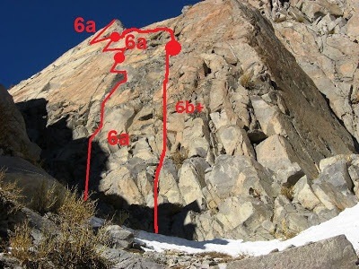
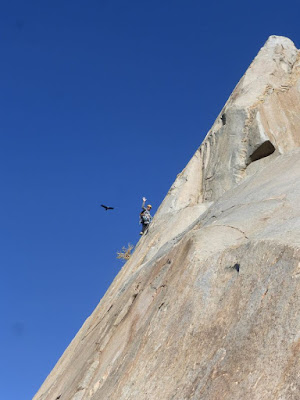

# Aguja: S2

**URL blog:** https://escaladaensosneado.blogspot.com/2014/10/aguja-s2.html
**Publicado:** Octubre 2014 | **Autor:** Lucas Alzamora

---

## Descripción General

Ubicada **inmediatamente detrás de la aguja "El Bolillo"**. Se reconoce por ser "una placa vertical, bien homogénea, con pocos sistemas de fisuras y una **cumbre bien triangular y pequeña** sobre la izquierda". El nombre proviene de la similitud con la aguja S en la zona del Chantén, Patagonia argentina.

**Aproximación:** Mismo acceso que El Bolillo, tomando el canal que sube sobre la derecha. Al entrar al acarreo, la aguja es visible sobre la izquierda. **Tiempo: 1 a 1:30 horas.**

---

## Imágenes

URLs originales:
- https://blogger.googleusercontent.com/img/b/R29vZ2xl/AVvXsEitIVN95KI_IKr2agM7lKN1i2xjpcZgi2nfcWceeaJHtOIzuVglrvIS6vBIFGRkgfichx0zW_WveiuE0qUGiZHGuDApfv9WEZdsfoLisgSLIC1O1F9CSCrK3r1DL7Fb5bVXUvbxOk9_wBZs/s400/s2.jpg
- https://blogger.googleusercontent.com/img/b/R29vZ2xl/AVvXsEiQ_RdqP_WRTY1ExEgUwUik5c_OKEkw60EDstmyGepybDN50vOqm2J-1-xFvbLj5qfvL6wdEyEfRb-bsK8T6eH-6TFZufkEjuNZKH19BlXrG79vLSoMnDM5P3Clb1clQr7zx_BtKeO3jSNy/s400/ws2.jpg

---

## Vías

### Vía 1: "PETÓ EL GORDO" ⭐⭐⭐
- **Largo total:** 120 metros
- **Grado:** 6a
- **Primer ascenso:** Lucas Alzamora y Diego Nakamura (14 Junio 2008)

| Largo | Metros | Grado | Descripción |
|-------|--------|-------|-------------|
| 1° | 45m | 6a | Diedro/canal fisurado casi en el centro de la pared. A 20m gira izquierda hacia placa vertical con protecciones pequeñas, buscando fisura de manos horizontal. |
| 2° | 35m | 6a | Continúa fisura de manos verticalmente. Placa con protecciones delicadas hasta salir a la derecha del triángulo cumbrero. |
| 3° | 45m | 5+/6a | Travesía bajo el triángulo hacia excelente fisura vertical de manos hasta la cumbre. |

**Equipo:** Cuerda 50m, juego camalots, empotradores pequeños, clavos finos, cintas largas, mosquetones simples, material reunión.

**Bajada:** Canal tras la cumbre, destrepe cuidadoso o rappel sobre bloque.

---

### Vía 2: "EL RECOLECTOR DE BASURA" ⭐⭐⭐
- **Largo total:** 110 metros
- **Grado:** 6b+
- **Primer ascenso:** Lucas Alzamora y Willy Ubelli (Abril 2015)

| Largo | Metros | Grado | Descripción |
|-------|--------|-------|-------------|
| 1° | 55m | 6b+ | Comienza 10m a la derecha de "Petó el gordo" por sistema de fisuras hacia canal. Sección más difícil en este tramo hasta pequeña repisa. |
| 2° | 50m | 6a | Travesía fácil pero desprotegida hasta base de cabeza. Travesar hacia fisura vertical (#2 camalot) conectando con otra vía. |
| 3° | ~5m | — | **Últimos 5m a la cumbre desasegurados**, roca monolítica sin protección. |

**Equipo:** Cuerda 60m, camalots hasta #3 con tallas medianas repetidas, cintas largas, mosquetones, material reunión.

**Bajada:** Igual que "Petó el gordo".

---

## Descripción Original

Esta aguja se encuentra inmediatamente detrás de la aguja "el bolillo", es fácilmente reconocible por tratarse de una placa vertical, bien homogénea, con pocos sistemas de fisuras y una cumbre bien triangular y pequeña sobre la izquierda de la parte alta de la aguja. Debe su nombre a una leve similitud con la aguja de la S en la zona del chanten en la patagonia argentina.

Aproximación: la misma que para el bolillo, pero tomando el canal que sube sobre la derecha de esta aguja. Apenas entramos al acarreo veremos claramente la aguja sobre nuestra izquierda.
Tiempo: 1hs a 1 1/2hs

Vía: "Petó el gordo", 120mts, 6a, ***
(Lucas Alzamora y Diego Nakamura. 14 de junio de 2008)

La vía comienza por un diedro/canal fisurado casi en el centro de la pared, luego de unos 20mts vira un poco a la izquierda para meterse en una placa vertical de protecciones pequeñas, y buscando una buena fisura de manos, horizontal hacia la izquierda donde montamos la reunión. (Largo 1°: 45mts, 6a). De la reunión seguimos por la fisura de manos que luego se hace vertical y se corta. Escalamos por una placa con protecciones delicadas hasta salir a la derecha del triángulo de la cumbre donde montamos la reunión. (Largo 2°: 35mts, 6a). De aquí salimos hacia la izquierda pasando todo el triángulo cumbrero traveseando por debajo, hasta conectar una excelente fisura vertical de manos que nos lleva derecho a la cumbre. La reunión la montamos unos metros antes de la cumbre sobre unas fisuras angostas (Largo 3°: 45mts, 5+/6a).

Equipo: 1 cuerda de 50mts, un juego completo de camalots y en especial empotradores pequeños, incluso algún clavo fino nos ayudará. Cintas largas, mosquetones simples y material para reunión.
Bajada: por el canal detrás de la cumbre, podemos destrepar con mucho cuidado o montar un rappel sobre un bloque para mas seguridad. Siguiendo por el mismo conectamos el acarreo de subida.

Vía: "El Recolector de basura", 110mts, 6b+, ***
(Lucas Alzamora y Willy Ubelli. abril de 2015)

Una excelente ruta de escalada por la calidad de la roca y lo disfrutáble de los largos. La vía comienza unos diez metros a la derecha de "Peto el gordo" por un sistema de fisuras evidentes que nos conducen a una especie de canal, visible desde la base de la pared, donde encontraremos la parte mas difícil del largo y de la vía. Superando esta sección continuamos por el mismo sistema de fisuras verticales hasta llegar a una pequeña repisa muy cerca del hombro de la aguja, donde montamos la primer reunión. (Largo 1°: 55mts, 6b+). El segundo largo nos presenta una travesía fácil pero imposible de proteger hasta llegar a la base de la cabeza de la aguja. Luego seguimos en travesía para conectar una fisura vertical perfecta de camalot #2, donde nos unimos con la otra vía, y nos deposita en una terraza donde montamos la reunión antes de atacar los últimos metros a la cumbre. (Largo 2°: 50mts, 6a). Los últimos 5mts a la cumbre conviene hacerlos asegurado ya que se trata de una roca monolítica de nula protección.

Equipo: 1 cuerda de 60mts, un juego completo de camalots hasta el #3 y tallas medianas repetidas. Cintas largas, mosquetones simples y material para la reunión.
Bajada: Igual que "Peto el gordo".
