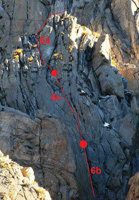
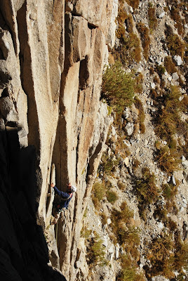

# Aguja: EL PEINE

**URL blog:** https://escaladaensosneado.blogspot.com/2014/10/aguja-el-peine.html
**Publicado:** Octubre 2014 | **Autor:** Lucas Alzamora

---

## Descripción General

"El Peine es una pequeña aguja ubicada inmediatamente detrás de la S2, separada únicamente por un angosto canal que es el que usamos para bajar de estas agujas."

**Aproximación:** La misma que para El Bolillo, pero tomando el canal que sube sobre la derecha de esta aguja. Al entrar al acarreo se ve claramente la aguja S2 sobre la izquierda y más atrás la formación de El Peine. **Tiempo: 1 a 1:30 horas.**

---

## Imágenes

URLs originales:
- https://blogger.googleusercontent.com/img/b/R29vZ2xl/AVvXsEiooQIbfZqgTbNqCSe7VerYG72lAHkTC-rR2VdZQtWRKdzDFlE5orDUD-WCNrWm_OEC-c7_oWQLGgVBoi0NQABBz6W8f1hRwIiDfa1VzsoRk_LCdOLSlEncOqzeLszPZAkbzsT-W2AOoFS7/s400/peine1.jpg
- https://blogger.googleusercontent.com/img/b/R29vZ2xl/AVvXsEjhlzD-r8c47JVqtp5tQEuWFn1Q20d5fb6Ajj7WVLdI2k87X0-NpGgtn96f9UJnoPnoDIkYIrtcACwB2Qk_PqOL81uikoqnIBawEJ1Pm5raR9o93lXWxg4_dsclw5jirjyl8NewkzZAOKUL/s400/peine2.jpg

---

## Vías

### Vía 1: "LOS PIOJOS" ⭐⭐⭐
- **Largo total:** 130 metros
- **Grado:** 6c
- **Primer ascenso:** Carloncho Guerra, Lucas Alzamora y Diego Molina (8 de Abril 2012)

| Largo | Metros | Grado | Descripción |
|-------|--------|-------|-------------|
| 1° | 40m | 6b | Comienza sobre la derecha por un diedro que se vuelve vertical hasta un pequeño techo. Superarlo y conectar fisuras hasta un pequeño balcón donde se monta reunión. |
| 2° | 40m | 6b+/c | Placa con fisuras pequeñas, techo, fisuras angostas con vegetación y bloques hasta repisa cómoda. |
| 3° | 50m | 6a | Zona fácil hacia la izquierda pasando a la parte alta. Pasitos técnicos hacia la cumbre sobre bloques. |

**Material:** 2 juegos completos de camalots, con algunos pequeños o stoppers, 2 cuerdas de 50m, cintas largas, mosquetones varios y material para reunión.

**Bajada:** Con cuidado desde la cumbre destrepar al canal que se encuentra en la base de la aguja Adidas para luego continuar por el canal que conduce al gran acarreo.

---

## Descripción Original

El peine es una pequeña aguja ubicada inmediatamente detrás de la S2, separada únicamente por un angosto canal que es el que usamos para bajar de estas agujas.

Aproximación: la misma que para el bolillo, pero tomando el canal que sube sobre la derecha de esta aguja. Apenas entramos al acarreo veremos claramente la aguja S2 sobre nuestra izquierda y mas atrás la formación de "El Peine".
Tiempo: 1hs a 1 1/2hs

Vía: "Los piojos", 130mts, 6c, ***
(Carloncho Guerra, Lucas Alzamora y Diego Molina, 8 de abril de 2012)

Comenzando sobre la derecha de la pared, por un diedro que a medida que progresamos se va poniendo vertical hasta llegar a un pequeño techito, tras superarlo conectamos una sucesión de buenas fisuras hasta llegar a un pequeño balcón donde montamos la reunión (Largo 1°: 40mts, 6b). Continuamos por una placa con fisuras pequeñas a su derecha para luego volver sobre nuestra izquierda, pasamos un pequeño techo y encontramos unas fisuras angostas con vegetación en su interior que nos obliga a ir pasándonos de fisura en fisura con pasos delicados y de equilibrio, seguimos por una zona mas fácil con bloques hasta montar la reunión en una cómoda repisa (Largo 2°: 40mts, 6b+/c). Continuamos por una zona fácil que nos va llevando a la izquierda para encontrar la pasada a la parte alta de la aguja, algunos pasitos técnicos nos llevan a buscar la cumbre ya sobre la derecha a pocos metros sobre bloques de poca dificultad (Largo 3°: 50mts, 6a).

Equipo: 2 juegos completos de camalots, con algunos pequeños o stoppers, 2 cuerdas de 50mts, cintas largas, mosquetones varios y material para reunión.
Bajada: Con cuidado desde la cumbre podemos destrepar a el canal que se encuentra en la base de la aguja adidas para luego continuar por el canal que conduce al gran acarreo.
