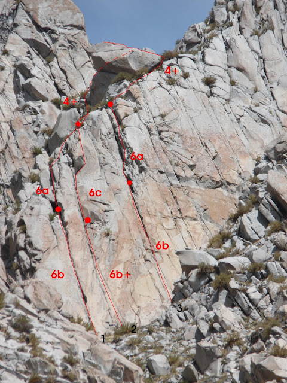
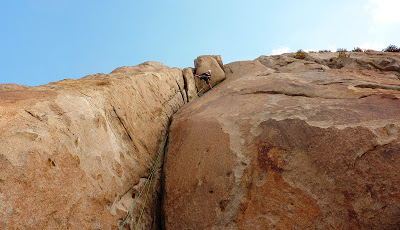

# Aguja: EL CÓNDOR (Pequeña Aguja pero muy Estética)

**URL blog:** https://escaladaensosneado.blogspot.com/2014/10/aguja-el-condor.html
**Publicado:** Octubre 2014 | **Autor:** Lucas Alzamora

---

## Descripción General

"Pequeña aguja pero muy estética. **La cumbre es un gran bloque con punta que se asemeja a la cabeza de un cóndor** y las grandes placas de su base parecen sus alas."

**Aproximación:** La misma que para la S2 pero unos metros antes y sobre la derecha del canal.

---

## Imágenes

URLs originales:
- https://blogger.googleusercontent.com/img/b/R29vZ2xl/AVvXsEjnq9ECxCOaOYo7yTnSCKyT7T7WgFs9Rton6dMz28mEFQaBKBX_AiKz98M3jRmLkszcVVSIwcorahC_6aiPg9OUFskqNnl8wK4szJVCvywH8b_eBXS8bnNAsGW8FkBNEknR8eImDWo5LDfF/s640/condor.JPG
- https://blogger.googleusercontent.com/img/b/R29vZ2xl/AVvXsEh4eUzxM80xR-RO0gEIGQLwChKKsV5Zh9rTDXp8KTqmZP5GuJ79WZKvOTiu7LlGaG9mDjiC7PvTGGBx0tvHf3upH7g53lssE1I24X4LBIDs6zwpkD65tFEdoTi-SaIjaXhj1WLvYuNXHm08/s640/piedra1.JPG
- https://blogger.googleusercontent.com/img/b/R29vZ2xl/AVvXsEh0wNPK9EZAjExWXkm-mLCcWFHexktbih0Zp5HzeftCdfWG3BvUWkPweI45szNkI01St9Tp8fcw6_eJOX1TOD7QkH950qwFcOWkaADxwlODYKqBpAAwWcQwDQe2j3e5HiwrIqPFN24n1sXS/s400/piedra2.JPG
- https://blogger.googleusercontent.com/img/b/R29vZ2xl/AVvXsEgEe86WH3Mjd33lEHFIiH6lFT40HaBHahegmYiubTCSlBoG5KncnGK2Itwj_ybWdNPYZ_9vHKrIsXp6AG65PC90_PpwIUKGuMXJxrDAv88YIzrSlmKBdtkrehM_hzs-nr-OzpWhRT5ClELb/s400/condor.jpg

---

## Vías

### Vía 1: "DUCAGD" ⭐⭐⭐
- **Largo total:** 140 metros
- **Grado:** 6b
- **Primer ascenso:** Lucas Alzamora y Adrián Parella (Junio 2009)

| Largo | Metros | Grado | Descripción |
|-------|--------|-------|-------------|
| 1° | 45m | 6b | Sobre la izquierda de la pared este (gran placa naranja), nace una fisura vertical perfecta para empotres de manos, que se va ensanchando a mitad del largo y luego vuelve a su tamaño. Al final en pequeña repisa se monta la reunión. |
| 2° | 45m | 6a | Salir tomando una fisura a la izquierda para luego ir buscando un pequeño diedro unos metros más arriba sobre la derecha y continuar en dirección a la cumbre. Reunión sobre unos bloques. |
| 3° | 50m | 4+ | Terreno más sencillo con algunos pasos sobre grandes lajas. Rodear la cumbre por la izquierda donde se encuentra la pasada más fácil. |

**Equipo:** 1 cuerda de 50m, 1 juego completo camalots con **#1 y #2 repetidos** para proteger mejor el primer largo, cintas largas, mosquetones simples y material para reunión.

**Bajada:** Destrepe con cuidado en dirección al canal: S2-Cóndor.

---

### Vía 2: "PIEDRA QUE RUEDA NO HACE MOUSE DE CHOCOLATE" ⭐⭐⭐⭐
- **Largo total:** 140 metros
- **Grado:** 6c
- **Primer ascenso:** Carloncho Guerra, Lucas Alzamora y Peta Ramirez (05 de Marzo 2011)

| Largo | Metros | Grado | Descripción |
|-------|--------|-------|-------------|
| 1° | 45m | 6a+/6b | Comienza por una placa vertical con 2 sistemas de fisuras paralelas, ambas muy finas. Parte superior del largo: pasos de equilibrio sobre protecciones muy pequeñas. Pequeña repisa para reunión. |
| 2° | 35m | 6c | Saliendo de la reunión hay un diedro de muy cómoda progresión que lleva directo a un techo. Superarlo por la derecha y continuar por el diedro fisura que forma el bloque del techo hasta pequeña repisa. |
| 3° | 60m | 5° | Continuar sobre terreno fácil, entre algunos arbustos, hasta unirse con la última parte de la vía "Ducagd". Rodear el bloque de la cumbre por la izquierda. ⚠️ Conviene hacer este largo en dos tramos por el rozamiento. |

**Equipo:** 1 cuerda de 50m, 1 juego completo de camalots **incluidos los más pequeños**, algunos stoppers, cintas largas, mosquetones simples y material para reunión.

**Bajada:** La misma que la vía "Ducagd".

---

## Descripción Original

Pequeña aguja pero muy estética. La cumbre es un gran bloque con punta que se asemeja a la cabeza de un condor y las grandes placas de su base parecen sus alas.

Aproximación: La misma que para la "S2" pero unos metros antes y sobre la derecha del canal.

Vía: "Ducagd", 140mts, 6b, ***
(Lucas Alzamora y Adrián Parella. Junio 2009)

Sobre la izquierda de la pared este (gran placa naranja), nace una fisura vertical, perfecta para empotres de manos, que se va ensanchando un poco a mitad del largo y luego vuelve a su tamaño. Al final de la misma y en una pequeña repisa montamos la reunión. (Largo 1°: 45mts, 6b). Salimos tomando una fisura a nuestra izquierda para luego ir buscando un pequeño diedro unos metros mas arriba sobre la derecha y luego continuamos en dirección a la cumbre y montamos la reunión sobre unos bloques. (Largo 2°: 45mts, 6a). Ya por terreno mas sencillo con algunos pasos sobre grandes lajas. Rodeamos la cumbre por la izquierda donde encontramos la pasada mas fácil para llegar a la cumbre. (Largo 3°: 50mts, 4+).

Equipo: 1 cuerda de 50mts, 1 juego completo camalots con un #1 y un #2 repetidos para proteger mejor el primer largo, cintas largas, mosquetones simples y material para reunión.
Bajada: Destrepe con cuidado en dirección al canal: "S2"-"Cóndor".

Vía: "Piedra que rueda no hace Mouse de chocolate", 140mts, 6c, ****
(Carloncho Guerra, Lucas Alzamora y Peta Ramirez. 05 de marzo de 2011)

Unos pocos metros a la derecha de la vía "Ducagd" nace esta excelente línea. Comienza por una placa vertical con 2 sistemas de fisuras paralelas, ambas muy finas. En la parte superior del primer largo nos encontramos con unos pasos de equilibrio sobre protecciones muy pequeñas. Unos metros mas arriba se abre una pequeña repisa donde montamos la reunión. (largo 1°: 45mts, 6a+/6b). Saliendo de la reunión encontramos un diedro de muy cómoda progresión que nos lleva directo a un techo, el mismo lo superamos por la derecha y continuamos por el diedro fisura que forma el bloque del techo hasta una pequeña repisa. (Largo 2°: 35mts, 6c). Continuamos ya sobre terreno fácil, buscando el camino entre algunos arbustos hasta unirnos con la última parte de la vía "Ducagd". Quizás es conveniente realizar este largo en dos tramos ya que el rozamiento hace que la cuerda no nos deje escalar libremente. (Largo 3°: 60mts, 5°). Rodeamos el bloque de la cumbre por la izquierda para llegar a la misma.

Equipo: 1 cuerda de 50mts, 1 juego completo de camalots incluidos los mas pequeños, algunos stoppers, cintas largas, mosquetones simples y material para reunión.
Bajada: La misma que la vía "Ducagd".

Vía: "Gargamel", 120mts, 6b, ***
(Lucas Alzamora y Willy Ubelli. Abril de 2015)

Una vía muy atractiva por presentar largos con muy buena roca, fisuras de fácil protección y grado medio. Es muy visible desde el comienzo del canal ya que discurre por una fisura neta que recorre el centro de la pared formando una especie de chimenea en el centro de la misma.

La vía comienza por unas fisuras finas a la izquierda de un gran bloque. Tras superar unos pasos delicados de equilibrio la fisura se va volviendo mas ancha hasta convertirse en una chimenea que nos permite montar la reunión en un lugar amplio y cómodo. (Largo 1°: 50mts, 6b). Salimos por unos pequeños techitos fáciles y con evidentes protecciones hasta conectar con una zona mas fácil de grandes bloques que nos depositan justo debajo del gran bloque cumbrero donde montamos la reunión. (Largo 2°: 50mts, 6a). Podemos salir de la reunión rodeando el bloque por izquierda o por derecha con una fácil escalada que es posible realizar desencordados, son 20mts de 3° grado hasta la cumbre.

Equipo: 1 cuerda de 50mts, 1 juego completo de camalots incluidos camalot #4 y #5, algunos stoppers, cintas largas, mosquetones simples y material para reunión.
Bajada: La misma que la vía "Ducagd".

---

### Vía 3: "GARGAMEL" ⭐⭐⭐
- **Largo total:** 120 metros
- **Grado:** 6b
- **Primer ascenso:** Lucas Alzamora y Willy Ubelli (Abril 2015)
- **Nota:** "Una vía muy atractiva por presentar largos con muy buena roca, fisuras de fácil protección y grado medio. Es muy visible desde el comienzo del canal ya que discurre por una fisura neta que recorre el centro de la pared formando una especie de chimenea."

| Largo | Metros | Grado | Descripción |
|-------|--------|-------|-------------|
| 1° | 50m | 6b | La vía comienza por unas fisuras finas a la izquierda de un gran bloque. Tras superar unos pasos delicados de equilibrio la fisura se va volviendo más ancha hasta convertirse en una chimenea. Reunión en lugar amplio y cómodo. |
| 2° | 50m | 6a | Salir por unos pequeños techitos fáciles y con evidentes protecciones hasta conectar con zona más fácil de grandes bloques que lleva debajo del gran bloque cumbrero. |
| 3° | 20m | 3° | Rodear el bloque por izquierda o por derecha con fácil escalada que puede realizarse desencordado. |

**Equipo:** 1 cuerda de 50m, 1 juego completo de camalots **incluido camalot #4 y #5**, algunos stoppers, cintas largas, mosquetones simples y material para reunión.

**Bajada:** La misma que la vía "Ducagd".
