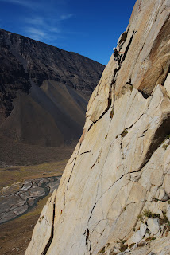
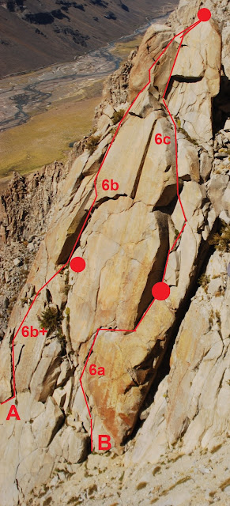

# Aguja: BASE DE LANZAMIENTO

**URL blog:** https://escaladaensosneado.blogspot.com/2014/10/aguja-base-de-lanzamiento.html
**Publicado:** Octubre 2014 | **Autor:** Lucas Alzamora

---

## Descripción General

"Esta es una pequeña aguja ubicada justo por debajo de la aguja 'El Misil', la reconoceremos fácilmente por su **cumbre pequeña y totalmente chata**."

**Aproximación:** Desde el campamento salir por la meseta de los bloques hasta el "gran acarreo" que baja del circo superior. Subir por el mismo. En un pequeño acarreo que sale a la derecha, hay un gran bloque que forma una cueva a mitad del canal. El primer acarreo a la derecha es el de la bajada del Bolillo; el que sigue es el correcto. Subir por el canal que lleva a la cara oeste del Misil, la aguja Adidas y la Base de Lanzamiento — esta última se encuentra unos metros más arriba de la cueva y justo debajo de las grandes placas del Misil. **Tiempo: ~2 horas.**

---

## Imágenes

URLs originales:
- https://blogger.googleusercontent.com/img/b/R29vZ2xl/AVvXsEhvIV5KEub7g4nLrr6I0vap4efPT7GdSBQEow9wewN_7xmKjhuvaZLSKNuWPXIzZaP8X1Yhz_xhFL9_FWpFmpvlDZ7PJml-YEoFxF08anLbxIjCYBGHaCrRT6TQjn2KLJM7fOEVxxr0vT-Q/s320/DSC_3354.JPG
- https://blogger.googleusercontent.com/img/b/R29vZ2xl/AVvXsEgprFaAJVupNSuTe2TOTh4T-ce6s5_2lbwBXJ5vjOG5mE7cTUs1RJHYI_Tf2ckCo-1WOAzgh6Ib3YawH3D8tUnmW8F6QmeoZ4KVGj15PN0uEBzx_60g1Lytt5A_hwtBg7fC-N2nhbrQ5VPb/s640/Base+de+Lanzamiento+.JPG

---

## Vías

### Vía 1: "BOCATO DI CARDINAL" ⭐⭐⭐
- **Largo total:** 80 metros
- **Grado:** 6c
- **Primer ascenso:** Lucas Alzamora, Adrián Parella y Gabo Zurdo (Junio 2009)

| Largo | Metros | Grado | Descripción |
|-------|--------|-------|-------------|
| 1° | 40m | 6a | La vía comienza por un diedro en el centro de la pared norte, luego toma una fisura horizontal hacia la izquierda. Donde termina comienza un pequeño diedro de dedos algo tumbado. Montar reunión sobre buenas fisuras horizontales. |
| 2° | 40m | 6c | Seguir por el diedro que conduce a un pequeño techo. Antes del techo: tramo con fisura muy ancha algo incómodo. En el techo: **pasos más duros de la vía**. Luego terreno más fácil y fisura ancha tipo chimenea que deja directo en la cumbre. (1 chapa con argolla + 1 clavo) |

**Equipo:** Con un juego completo de camalots iremos bien, y algún #0.2 o stopper pequeño para proteger la salida del techo. 2 cuerdas de 60m, cintas largas, mosquetones simples y material para reunión.

**Bajada:** Mediante un rappel desde la cumbre en dirección a un canal a la derecha de la vía.

---

## Descripción Original

Esta es una pequeña aguja ubicada justo por debajo de la aguja "El misil", la reconoceremos fácilmente por su cumbre pequeña y totalmente chata.

Aproximación: desde el campamento salimos por la meseta de los bloques hasta el "gran acarreo" que baja del circo superior. Subimos por el mismo y en un pequeño acarreo que sale a nuestra derecha, veremos un gran bloque que forma una cueva a mitad del canal. Para ubicarlos mejor, el primer acarreo a nuestra derecha es el de la bajada del bolillo, el que sigue es el que tenemos que tomar. Subimos por el canal que es el que nos lleva a la cara oeste del misil, la aguja adidas y la base de lanzamiento, esta es la que encontraremos unos metros mas arriba de la cueva y justo debajo de las grandes placas del misil.
Tiempo: 2hs aprox.

Vía: "Bocato di cardinal", 80mts, 6c, ***
(Lucas Alzamora, Adrián Parella y Gabo Zurdo. Junio de 2009)

La vía comienza por un diedro en el centro de la pared norte y luego toma una fisura horizontal hacia la izquierda, donde termina comienza un pequeño diedro de dedos algo tumbado, a mitad del mismo sobre unas buenas fisuras horizontales montamos la reunión. (Largo 1°: 40mts, 6a). Seguimos por el diedro que conduce a un pequeño techo, antes de este debemos superar un tramo con fisura muy ancha algo incómodo. En el techo encontramos los pasos mas duros de la vía. Luego seguimos por terreno mas fácil y una fisura ancha tipo chimenea que nos deja directo en la cumbre. (Largo 2°: 40mts, 6c, 1 chapa con argolla y un clavo).

Equipo: Con un juego completo de camalots iremos bien, y algún #0.2 o algún stopper pequeño para proteger la salida del techo. 2 cuerdas de 60mts, cintas largas, mosquetones simples y material para reunión.
Bajada: Mediante un rappel desde la cumbre y en dirección a un canal a la derecha de la vía.

Vía: "io creo en el amor!!!", 90mts, 6b+, ***
(Carloncho Guerra y Lucas Alzamora, 6 de abril de 2012)

La vía comienza sobre el lado izquierdo de la pared, casi en el filo mismo y luego va buscando conexiones de fisuras para llegar a la cumbre. Sobre una fisura con escamas en su interior vamos ganando metros hasta una fisura en diagonal a la derecha que nos conecta con otras fisuras verticales mas fáciles hasta llegar a un nicho debajo de una ancha chimenea donde montamos la primer reunión (Largo 1°: 40mts, 6b+). Superamos la chimenea pero por la derecha buscando unas pequeñas fisuras por encima de un pequeño techito para luego volver a la chimenea unos metros mas arriba donde la fisura se angosta un poco. Luego vamos progresando por fisuras mas fáciles hasta llegar a la cumbre (Largo 2°: 50mts, 6b).

Equipo: 2 juegos completos de camalots. 2 cuerdas de 60mts, cintas largas, mosquetones simples y material para reunión.
Bajada: Mediante un rappel desde la cumbre y en dirección a un canal a la derecha de la vía.

---

### Vía 2: "IO CREO EN EL AMOR!!!" ⭐⭐⭐
- **Largo total:** 90 metros
- **Grado:** 6b+
- **Primer ascenso:** Carloncho Guerra y Lucas Alzamora (6 de Abril 2012)

| Largo | Metros | Grado | Descripción |
|-------|--------|-------|-------------|
| 1° | 40m | 6b+ | La vía comienza sobre el lado izquierdo de la pared, casi en el filo mismo, luego va buscando conexiones de fisuras. Sobre una fisura con escamas en su interior, gana metros hasta una fisura en diagonal a la derecha que conecta con fisuras verticales más fáciles. Reunión en nicho debajo de ancha chimenea. |
| 2° | 50m | 6b | Superar la chimenea pero por la derecha, buscando pequeñas fisuras por encima de un pequeño techito, volver a la chimenea más arriba donde la fisura se angosta un poco. Progresar por fisuras más fáciles hasta la cumbre. |

**Equipo:** 2 juegos completos de camalots. 2 cuerdas de 60m, cintas largas, mosquetones simples y material para reunión.

**Bajada:** Mediante un rappel desde la cumbre en dirección a un canal a la derecha de la vía.
