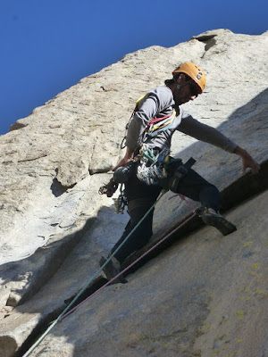
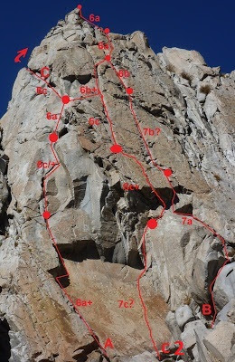
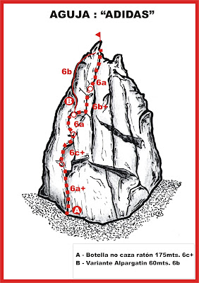
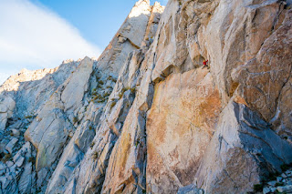
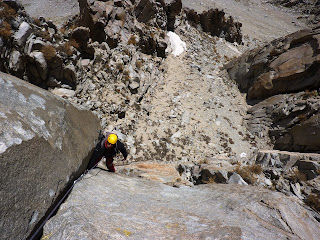
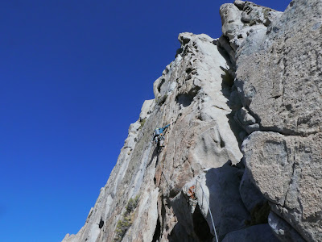

# Aguja: ADIDAS

**URL blog:** https://escaladaensosneado.blogspot.com/2014/10/aguja-adidas.html
**Publicado:** Octubre 2014 | **Autor:** Lucas Alzamora

---

## Descripción General

Una de las agujas **más estéticas y emblemáticas del valle**. Una pared con gran verticalidad surcada por **3 grandes fisuras** y una cumbre bien afilada. Escalada de grado medio/alto, muy atlética y continua sobre excelente roca y perfectas fisuras.

**Aproximación:** Ver descripción de aguja "Base de Lanzamiento". **Tiempo: ~2 horas.**

---

## Imágenes

URLs originales:
- https://blogger.googleusercontent.com/img/b/R29vZ2xl/AVvXsEjjWYpbX0h9XulBULPSBY7Qr_DtvZvqJEb2X140942Xn7BUrbFE1QR4r8lthmOKc4LR8hLEWqHtrQew3lhC-UxgCjiiu4NWVw3n74hKAk0PRr2J_4J8uucl4FnQHWCaNPjP4S1X4iqzibR7/s400/adidas.jpg
- https://blogger.googleusercontent.com/img/b/R29vZ2xl/AVvXsEi-fbOpprehCrThuE7rHWLgHcGYIol864CCuj862O4KC7toXsY6JBebQAlR-ucoQ7jQF2hKePVYqU6QyXMqSSdZZstcZLRB2bt2ETvrj_WkjQF3zsPFkPXvyQWDCToPjqIOb2Uwft8JBtME/s400/topoa.JPG
- https://blogger.googleusercontent.com/img/b/R29vZ2xl/AVvXsEgn8-A-xIpuhzODRaVy8dyR4-xlRjmg7zs8RFXcII9Eu62WOrOaPS1bC4VdK4_k5Efipu0NMCJINhiBzE9wwRBYBAl_lKfoetpghBO4weElK2X01yH-d9royfx8-cvLKvRH6shM_ZLJzh_m/s400/adidas+vias.jpg
- https://blogger.googleusercontent.com/img/b/R29vZ2xl/AVvXsEhR9aH90i_-QsAqMx3jUCrgsm1eESYnIrWt-NxcJRx5_DG6bsumYcObVLkYPYQnlYbbnwzoHjmtAw4oJ50EwWw6lqS5iSPefm73yEhuxWxGXun9v4hzNQ4ZVgnZ3JFDbg23rbbaN5EbGHQi/s320/Aztlan+entrando+a+la+seccion+dura+de+El+Nazo%2C+7b.+Aguja+Adidas..jpg
- https://blogger.googleusercontent.com/img/b/R29vZ2xl/AVvXsEgF7wW7qA8vifABUxfe1bNhkQ1URs9aWWbdkcE67it9SDjAwKPkXFzwttU420ZQ62M6JyYZy9-LLmkhScsfgulAs_glwl30cVatgR9aDLYi1Sbxlph4pXOxp-PE1LUsNA-Cif8OnFHA-w9M/s320/P1020818.jpg
- https://blogger.googleusercontent.com/img/b/R29vZ2xl/AVvXsEiyJ4puDwGV6IccdFmH5ZGeWMhDin_niZeSDsBhfHRmHqwuzW1V8tO0nxkHsm0zWuPCqm8olbM7aLf1VZmzFWyT8p4occszQlUTSSTKcnUQeTvc3hpV-bCY_XbywulxCbCYewlFHwwZqqsg/s400/narcoclimbers.jpg

---

## Vías

### Vía 1: "BOTELLA NO CAZA RATÓN" ⭐⭐⭐⭐⭐
- **Largo total:** 170 metros
- **Grado:** 6c+
- **Primer ascenso:** Lucas Alzamora y Diego Nakamura (01 de Abril 2009)
- **Nota:** Una de las vías clásicas de la zona.

| Largo | Metros | Grado | Descripción |
|-------|--------|-------|-------------|
| 1° | 40m | 6a+ | Gran placa naranja sin fisuras en la base. Diedro evidente que comunica con placas fisuradas hasta la 1° reunión, donde se forma un nicho con una laja. (1 chapa) |
| 2° | 20m | 6c+ | Tomar la laja hacia la derecha hasta conectar pequeño diedro de manos. Reunión en pequeña repisa. |
| 3° | 30m | 6a | Pequeño techo evitado por la derecha. Retomar línea de fisuras hacia la izquierda. (1 chapa) |
| 4° | 35m | 6b+ | Salir hacia la derecha desde la reunión por placa delicada y expuesta. Conectar sistema de fisuras. Diedro fisura atlético hasta reunión encima de un bloque. (opción original, 1 chapa) |
| **4° variante "Alpagatin"** | 45m | 6c | (Carloncho Guerra y Aztlan Medio) Encarar directo hacia arriba por fisuras anchas diagonales muy atléticas. Protección delicada. Reunión debajo de cumbre izquierda. |
| 5° | 50m | 6a | Varios sistemas de fisuras desde reunión del largo 4. Tomar el de la derecha directo al filo entre las dos cumbres. |

**Equipo:** 2 cuerdas de 50m, 1 juego completo de camalots con #4, stoppers, cintas largas, mosquetones, material para reunión.

**Bajada:** Primer rappel sobre gran laja debajo de cumbre principal (izquierda). Conectar reuniones equipadas.

---

### Vía 2: "A BATMAN LE LLORO LA NENA" ⭐⭐⭐⭐
- **Largo total:** 115 metros
- **Grado:** 7a
- **Primer ascenso:** Lucas Alzamora, Carloncho Guerra, Diego Molina (7 Abril 2012)
- **Nota:** "Excelente vía de altísima calidad, con dificultad alta, sobre perfecto granito y bien vertical."

| Largo | Metros | Grado | Descripción |
|-------|--------|-------|-------------|
| 1° | 50m | 6c+/7a | Comienza a la derecha de gran placa de base, sobre pequeño espolón en travesía hacia la derecha. Pequeñas fisuras verticales con primer crux. Tramo más fácil, luego techo con fisura a cada lado (segundo crux). Reunión en estrecha repisa. (2 chapas) |
| 2° | 40m | 7a | Conecta gran fisura visible del centro de la pared. Comienza estrecha con movimientos delicados. Se ensancha a **incómodo offwidth vertical y patinoso** (tramo más duro). Después relaja. Desplomes con buenos cantos hasta segunda reunión. (2 chapas) |
| 3° | 25m | 6b+ | Ancha fisura con posibilidades de pisar por fuera. Se angosta. Conecta con reunión de la vía "Botella" donde se unen los itinerarios. (2 chapas) |

**Equipo:** 2 cuerdas de 60m, 2 juegos completos de camalots, **#5 para segundo largo** y algunos pequeños o stoppers, cintas largas, mosquetones, material de reunión.

**Bajada:** 4 rappeles por la misma línea desde la cumbre. Primero sobre bloque con cintas, otros sobre chapas con argollas.

---

### Vía 3: "EL NAZO (THE NOSE)" ⭐⭐⭐⭐⭐
- **Largo total:** 170 metros
- **Grado:** 7b+
- **Primer ascenso:** Lucas Alzamora y Aztlan Medio (Abril 2015)
- **Nota:** "Una vía impresionante con continuidad de grado, aérea y roca excelente."

| Largo | Metros | Grado | Descripción |
|-------|--------|-------|-------------|
| 1° | 40m | 7b+ | Grandes placas del centro de la pared. **6 chapas con parabolt** en esta sección. Duros movimientos de placa (pasos de 7b). Laja con pequeña fisura de dedos desplomada. Reunión bastante cómoda. (2 chapas) |
| 2° | 35m | 6c+ | Techo con fisura diagonal de derecha a izquierda justo encima de la reunión. Superar de forma atlética con buenas protecciones. Corta placa con fisuras que se pierden hacia izquierda. Chapa con parabolt guía a reunión en pequeña repisa. (2 chapas) |
| 3° | 40m | 6c | Sucesión de fisuras verticales perfectas con buena continuidad. A 20m arriba conectar 4° largo de "Botella". Continuar por mismo largo hasta final, usando misma reunión. (2 chapas) |
| 4° | 50m | 6a | Opción: continuar por último largo de "Botella" o salir directo por fisuras anchas hacia el col entre las dos cumbres. |

**Equipo:** 2 cuerdas de 50m, 1 juego completo de camalots con #4, stoppers, cintas largas, mosquetones, material para reunión.

**Bajada:** Primer rappel sobre gran laja debajo de cumbre principal (izquierda). Conectar reuniones equipadas.

---

### Vía 4: "NARCOCLIMBERS" ⭐⭐⭐
- **Largo total:** 130 metros
- **Grado:** 6a
- **Primer ascenso:** Tomás del Giovannino y Martín López Abad (Abril 2019)
- **Nota:** Vía alpina sin reuniones fijas. La más fácil para llegar a la aguja.

| Largo | Metros | Grado | Descripción |
|-------|--------|-------|-------------|
| 1° | — | ~5° | De la base de la aguja, continuar por canalón que sube en dirección oeste, trepidagueando, hasta donde se pone difícil. |
| 2° | 55m | 6a | Un largo de 5° hasta el col con gran bloque apoyado. |
| 3° | 35m | 4+ | Del col, encarar sistema de fisuras bien evidente sobre extremo derecho de placa norte. Llegar al filo. Continuar por filo buscando lo más fácil hasta repisa cumbrera. |

**Bajada:** Línea de rappeles equipados.

---

## Descripción Original

Una de las agujas mas estéticas y emblemáticas del valle. Una pared con gran verticalidad surcada por 3 grandes fisuras y una cumbre bien afilada la diferencian de sus compañeras. Su escalada es de grado medio/alto, muy atlética y continua y siempre sobre excelente roca y perfectas fisuras.

Aproximación: Ver descripción de aguja "base de lanzamiento". Tiempo: 2hs aproximadamente.

Vía: "Botella no caza ratón", 170mts, 6c+, *****
(Lucas Alzamora, Diego Nakamura, 01 de abril de 2009)

Una de las vías clásicas de la zona. En su base, la aguja presenta una gran placa naranja sin fisuras, justo sobre su izquierda nace un diedro evidente que luego comunica con placas fisuradas hasta la primer reunión (Largo 1°: 40mts, 6a+, 1 chapa). Justo encima de la reunión se forma un nicho con una laja en su parte superior. Tomamos la misma hacia la derecha hasta conectar con un pequeño diedro de manos. Al final del mismo y sobre una pequeña repisa montamos la reunión (Largo 2°: 20mts, 6c+). Sobre la reunión se forma un pequeño techo que evitamos por la derecha y luego retomamos la línea de fisuras un poco a la izquierda, estas nos llevan al siguiente relevo (Largo 3°: 30mts, 6a, 1 chapa). Aquí podremos optar por dos opciones. La vía original: de la reunión salimos hacia la derecha, paralelo a la misma, por una placa delicada y expuesta para conectar el sistema de fisuras que van directo a la cumbre. Progresamos por un diedro fisura atlético y de excelente calidad hasta encontrar la reunión encima de un bloque (Largo 4°: 35mts, 6b+, 1 chapa). O la variante "Alpagatin", abierta por Carloncho Guerra y Aztlan Medio, que encara directo para arriba tomando unas fisuras anchas diagonales muy atléticas y de protección delicada, montando la reunión debajo de la cumbre izquierda y entrando por detrás de la misma (Largo 4°: 45mts, 6c). Sobre la reunión del largo 4 de la vía original comienzan varios sistemas de fisuras, tomamos el de la derecha que nos conduce directo al filo entre las dos cumbres, de aquí elegimos cual subir y donde montar la reunión (Largo 5°: 50mts, 6a).

Equipo: 2 cuerdas de 50mts, 1 juego completo de camalots con #4 incluido para el 2° largo, algunos stoppers, cintas largas, mosquetones varios y material de reunión.
Bajada: El primer rappel es sobre una gran laja debajo de la cumbre principal (izq). Luego vamos conectando las reuniones equipadas.

Vía: "A Batman le lloro la nena", 115mts, 7a, ***
(Lucas Alzamora, Carloncho Guerra y Diego Molina, 7 de abril de 2012)

Una excelente vía, de altísima calidad en cada uno de sus largos, con dificultad alta, sobre perfecto granito y bien vertical.

La ruta comienza a la derecha de la gran placa de la base de la pared, sobre un pequeño espolón que nos va llevando en travesía hacia la derecha para conectar unas pequeñas fisuras verticales y donde encontramos el primer crux de la vía, luego un tramo un poco mas fácil nos lleva justo debajo de un techo con una fisura a cada lado, utilizando buenos empotres y los pies sobre la izquierda superamos el segundo crux que nos deja en una estrecha repisa donde encontramos la primer reunión (Largo 1°: 50mts, 6c+/7a, 2 chapas). El segundo largo busca conectar la gran fisura visible desde abajo en el centro de la pared, esta comienza bien estrecha, con movimientos delicados y de equilibrio sobre pequeños anclajes y a medida que ganamos altura se comienza a ensanchar hasta convertirse en un incómodo offwidth vertical y patinoso, donde encontramos el tramo mas duro de toda la vía, luego la escalada relaja un poco y superando unos desplomes con buenos cantos pero escasas fisuras para proteger llegamos a la segunda reunión (Largo 2°: 40mts, 7a, 2 chapas). Salimos por una ancha fisura pero con posibilidades de ir pisando por fuera hasta que se vuelve a angostar y tras unos pocos metros llegamos a una de las reuniones de la vía "Botella" en donde se unen los itinerarios. (Largo 3°: 25mts, 6b+, 2 chapas).

Equipo: 2 cuerdas de 60mts, 2 juegos completos de camalots, #5 para el segundo largo y algunos bien pequeños o stoppers, cintas largas, mosquetones varios y material de reunión.
Bajada: Por la misma línea mediante 4 rappeles desde la cumbre, el primero sobre un bloque con cintas y los otros sobre chapas con argollas.

Vía: "El Nazo (The nose)", 170mts, 7b+, ***
(Lucas Alzamora y Aztlan Medio. Abril de 2015)

Una vía impresionante!!! Con continuidad de grado, aérea y con roca excelente.

Comienza por las grandes placas del centro de la pared donde fueron colocadas 6 chapas con parabolt para proteger esta sección que exige duros movimientos de placa con pasos de 7b y nos conectan con una laja con pequeña fisura de dedos algo desplomada y lo que le terminan de dar el grado de dificultad al largo. Superado esto encontramos una reunión bastante cómoda. (Largo 1°: 40mts, 7b+, 2 chapas). Justo por encima de la reunión comienza un techo que en su centro tiene una fisura diagonal de derecha a izquierda. Superamos el mismo de forma atlética pero con buenas protecciones y conectamos una corta placa con fisuras que se van perdiendo y nos conducen a la izquierda donde encontramos otra chapa con parabolt, esta nos guía directo a la reunión en una pequeña repisa. (Largo 2°: 35mts, 6c+, 2 chapas). El tercer largo es una sucesión de fisuras verticales perfectas con buena continuidad. Unos veinte metros mas arriba de la reunión nos unimos al 4° largo de "botella...", y continuamos por la misma hasta el final de este largo utilizando la misma reunión. (Largo 3°: 40mts, 6c, 2 chapas). De aquí podemos continuar por el ultimo largo de "botella..." o salir directo por unas fisuras anchas que nos llevan al col entre las dos cumbres. (Largo 4°: 50mts, 6a).

Equipo: 2 cuerdas de 50mts, 1 juego completo de camalots con #4 incluido, algunos stoppers, cintas largas, mosquetones varios y material para reunión.
Bajada: El primer rappel es sobre una gran laja debajo de la cumbre principal (izq). Luego vamos conectando las reuniones equipadas.

Vía: "Narcoclimbers", 130mts, 6a
(Tomás del Giovannino y Martín López Abad. Abril de 2019)

Vía alpina sin reuniones. La más fácil a la aguja. De la base de la aguja, continuamos por el canalón que sube en dirección oeste, trepindagueando, hasta donde se pone difícil y tiramos un largo de 5° hasta el col, con un gran bloque apoyado. (2° largo 55m 6a) Del col, encaramos por un neto sistema de fisuras bien evidente sobre el extremo derecho la placa norte de la aguja, lo seguimos hasta llegar al filo. (3° largo 35m 4+) Continuamos por el filo buscando lo más fácil hasta llegar a la repisa cumbrera.
Bajada: Línea rappeles.
