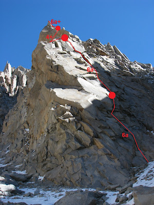
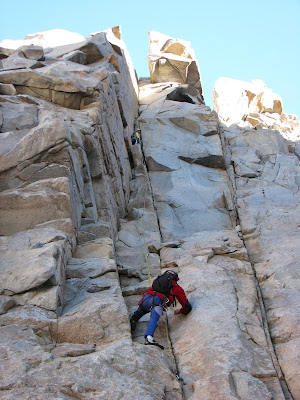

# Aguja: LA NAPIA

**URL blog:** https://escaladaensosneado.blogspot.com/2014/10/aguja-la-napia.html
**Publicado:** Octubre 2014 | **Autor:** Lucas Alzamora

---

## Descripción General

"Esta es una pequeña aguja del circo superior, pero no por ello poco atractiva. Su **forma triangular y su roca monolítica con muy pocas fisuras y líneas lógicas** la convierten en una escalada interesante."

**Aproximación:** Tomar el "gran acarreo" hasta donde culmina en la base de la aguja "Oreja". Ahí tomar un pequeño acarreo a la derecha. **Tiempo: ~2:30 horas.**

---

## Imágenes

URLs originales:
- https://blogger.googleusercontent.com/img/b/R29vZ2xl/AVvXsEhFwx82OmHe5bfNpMtBoiwynaiAb0ZpofAdZnNm1eTwJxdV68vHD_6ItGTTzQ-Ogbf5d8bVnKoGU4f-Ozjp2PDC4FG6LYj_sK82aK7NsRF_3Ow5Jih2ky0LjsqB6m7QLNfbrCBK3-Rqiurx/s400/IMG_5482.JPG
- https://blogger.googleusercontent.com/img/b/R29vZ2xl/AVvXsEjU-zFH2TOxUrJoyy630ug0xvibZIo_iot523NuWdrQgudlmXJG6gD8mH41jBI0qN3dLnl9P7D7feQOc02qCgqpgzc4xP7x2Othpsxn5c6p0UyREe7xqJfjzkR6Xxe7wxuNNPLFSZ0pZSkq/s400/IMG_5483.JPG

---

## Vías

### Vía 1: "DE MI CUARTO EN SOLEDAD" ⭐⭐⭐
- **Largo total:** 150 metros
- **Grado:** 6a+
- **Primer ascenso:** Lucas Alzamora, Diego Nakamura y Maxi Astete Millan (06 de Mayo 2008)

| Largo | Metros | Grado | Descripción |
|-------|--------|-------|-------------|
| 1° | 40m | 6a | Fisuras angostas que se ensanchan hasta un resalte. |
| 2° | 40m | 6a | Chimenea formada por bloque tumbado. |
| 3° | 30m | 4+ | Travesía hacia la izquierda, luego hacia la derecha. |
| 4° | 25m | 6a+ | Travesía aérea hacia la derecha. |
| 5° | 15m | 6a | Sistema de fisuras hasta la cumbre. |

**Equipo:** 1 juego completo de camalots hasta el #3, algunos empotradores, 2 cuerdas de 50m, material para reunión, cintas largas y mosquetones varios.

**Bajada:**
- Unos metros por debajo de la cumbre encontrar una instalación de rappel sobre 1 clavo y 1 stopper.
- A los 50m encontrar otro rappel montado sobre bloques con cinta.

---

## Descripción Original

Esta es una pequeña aguja del circo superior, pero no por ello poco atractiva. Su forma triangular y su roca monolítica con muy pocas fisuras y líneas lógicas la convierten en una escalada interesante, con la posibilidad de forzar en un futuro una difícil vía de carácter deportivo o mixta.

Aproximación: Tomando el "gran acarreo" hasta donde culmina en la base de la aguja "oreja", ahí tomamos un pequeño acarreo a nuestra derecha y a pocos metros veremos la inconfundible forma triangular de la aguja "la napia".
Tiempo: 2,30hs aprox.

Vía: "De mi cuarto en soledad", 150mts, 6a+, ***
(Lucas Alzamora, Diego Nakamura y Maxi Astete Millan, 06 de mayo de 2008)

Para comenzar la escalada debemos tomar un pequeño acarreo que sale a la derecha de la aguja. Unos metros mas arriba y viendo la pared ya de costado podremos observar esta lógica línea de subida y distinguiremos el característico diedro que se transforma en chimenea del segundo largo. El primer largo transita fisuras angostas pero netas, que se van ensanchando hasta un pequeño resalte donde montamos la reunión (Largo 1°: 40mts, 6a). Continuamos la misma línea de fisuras que conduce a una especie de chimenea formada por un gran bloque tumbado, a la salida de esta y sobre unas fisuras aplomadas armamos la segunda reunión (Largo 2°: 40mts, 6a). Por lo compacto de la roca es imposible seguir recto hacia arriba, por eso debemos efectuar una serie de largos cortos en travesía, buscando la línea evidente. De la reunión salimos hacia la izquierda, escalamos unos metros fáciles nuevamente para arriba y luego otra pequeña travesía a la derecha donde montamos la reunión en un gran bloque que sale directo al vacío (Largo 3°: 30mts, 4+). Aquí tendremos la cumbre sobre nosotros, pero para alcanzarla debemos efectuar otra pequeña travesía aérea hacia la derecha, para luego conectar un sistema de fisuras que asciende hasta la cumbre. En la primera ascensión este tramo lo realizamos en 2 largos cortos para evitar rozamientos pero es solucionable estirando mas las cintas de los seguros. (Largo 4°: 25mts, 6a+ y Largo 5°: 15mts, 6a).

Equipo: 1 juego completo de camalots hasta el #3, algunos empotradores, 2 cuerdas de 50mts, material para reunión, cintas largas y mosquetones varios.
Bajada: unos metros por debajo de cumbre encontramos una instalación de rappel sobre 1 clavo y 1 stopper. Rappelamos directo hacia el canal que esta debajo nuestro para evitar las travesías, a los 50mts encontramos otro rappel montado sobre bloques con cinta (prever material para abandonar). Este rappel ya nos conduce a la parte alta del canal de donde bajamos caminando.
