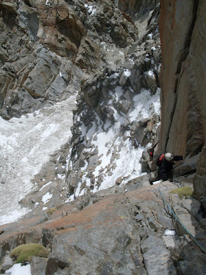

# Aguja: PLEGARIAS

**URL blog:** https://escaladaensosneado.blogspot.com/2014/10/aguja-plegarias.html
**Publicado:** Octubre 2014 | **Autor:** Lucas Alzamora

---

## Descripción General

"Aguja poco visible desde el acarreo principal. La distinguiremos una vez que pasamos la formación del alfeñique. Es una de las últimas agujas del circo superior, y no posee una forma determinada que le dé presencia."

**Aproximación:** La misma que para "La Napia" pero continuando por el acarreo lateral unos metros más hasta dejar atrás y a la izquierda a la aguja "Alfeñique". **Tiempo: ~2:45 horas.**

---

## Imágenes

URLs originales:
- https://blogger.googleusercontent.com/img/b/R29vZ2xl/AVvXsEjU29WektDLKza8lWr0okIeyjtPgL0RF-PeYZoiINcruYI5komb0KGWemII766ZTU3aTUPu_zqjQWVNO32cW_UMB0TSp41ymWBLDh6PU5ml66UzWGlOCVATzldS9DXrShULIWa9_hAHHwO7/s320/WhatsApp+Image+2020-04-01+at+9.51.21+PM.jpeg
- https://blogger.googleusercontent.com/img/b/R29vZ2xl/AVvXsEiGMZBCEx5jmZPqA9JyzLqEYL5F8VWyLUMmJDgg0ISP7L8u0UcwgfaSbO1VPyxPqeL9n-7zoZKzFf2ktFjVkiC4iRuGDufaTsyD_yDdZ-2-oqOowxl3bznxAzL6Nr3eYHDiD2uuZzMCOrC/s400/aguja+PLEGARIA.jpg
- https://blogger.googleusercontent.com/img/b/R29vZ2xl/AVvXsEjDs1ddSHEfT5IrxubMnS_9vWJgO-iOYhTTVS34ygUTQCThdRPwr0-bOSylPnryi0NcBkA6eooLTEaGVTz-x1kw0z8CO3V8JjBKMZdbrHF-OMpsdCjaSPHNmmMFl7I69ce_LgGcQBez8tg8/s400/SDC12318.JPG

---

## Vías

### Vía 1: "ORACIONES POR JUANCITO" ⭐⭐
- **Largo total:** 150 metros
- **Grado:** 6b
- **Primer ascenso:** Lucas Alzamora y Diego Nakamura (20 de Noviembre 2009)

| Largo | Metros | Grado | Descripción |
|-------|--------|-------|-------------|
| 1° | 40m | 5+ | "Diedro que luego se transforma en placa un poco aplomada." |
| 2° | 25m | 6b | "Pequeño diedro, es el tramo más difícil y técnico... angosta fisura muy delicada." |
| 3° | 45m | 6a | "Fisuras que luego se van tumbando y nos depositan en una gran repisa." |
| 4° | 40m | 5+ | "Bloques y con una escalada fácil pero con algunos pasos técnicos." |

**Equipo:** 2 cuerdas de 50m, 1 juego completo de camalots, 1 juego de empotradores, cintas largas, material de reunión y mosquetones varios.

**Bajada:** De la cumbre destrepar con cuidado ~20m hasta conectar un canal en el centro de la pared. Realizar 2 rappeles sobre este canal sobre reuniones naturales en bloques con cintas (prever material para abandonar). Luego pequeño destrepe hasta el pie de vía.

---

## Descripción Original

Una de las agujas del circo superior. Aproximación: la misma que para "la napia" pero continuamos por el acarreo lateral unos metros mas hasta dejar atrás y a nuestra izquierda a la aguja "alfeñique".
Tiempo: 2, 45hs aprox.

Vía: "Oraciones por juancito", 150mts, 6b, ***
(Lucas Alzamora y Diego Nakamura, 20 de noviembre de 2009)

Sobre la izquierda de la pared nacen varios sistemas de fisuras, debemos tomar por un pequeño diedro que luego se transforma en placa un poco aplomada. A nuestra izquierda tendremos una línea de fisura bien vertical que se ensancha hacia el final. Antes de finalizar el total de cuerda y justo debajo de un pequeño diedro montamos la reunión (Largo 1°: 40mts, 5+). El pequeño diedro es el tramo mas difícil y técnico de la escalada, es una angosta fisura muy delicada y técnica, superado esto y en una especie de nicho montamos la reunión (Largo 2°: 25mts, 6b). Salimos de la reunión un poco a la izquierda hasta conectar unas fisuras que luego se van tumbando y nos depositan en una gran repisa donde armamos la reunión (Largo 3°: 45mts, 6a). Desde este punto ya vemos la cumbre a nuestra derecha, sobre bloques y con una escalada fácil pero con algunos pasos técnicos llegamos a la cumbre (Largo 4°: 40mts, 5+).

Equipo: 2 cuerdas de 50mts, 1 juego completo de camalots, 1 juego de empotradores, cintas largas, material de reunión y mosquetones varios.
Bajada: de la cumbre destrepamos con cuidado unos 20mts hasta conectar un canal en el centro de la pared. Realizamos 2 rappeles sobre este canal y sobre reuniones naturales en bloques con cintas (prever material para abandonar). Luego un pequeño destrepe hasta el pie de vía.
