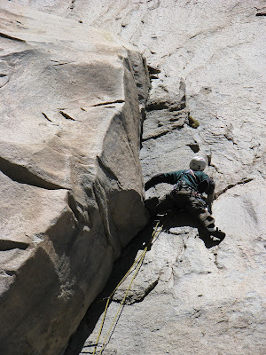
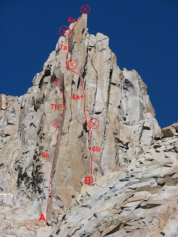
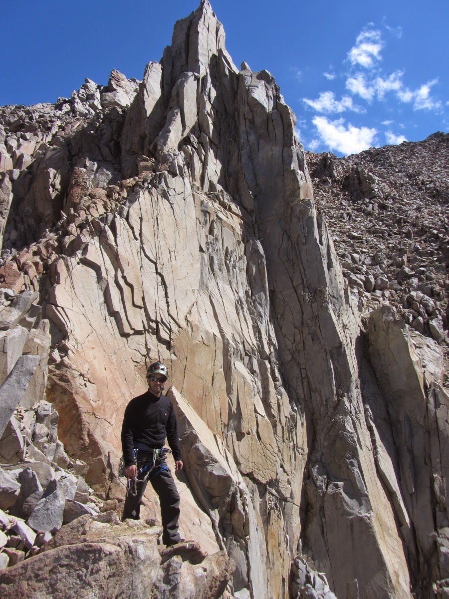

# Aguja: GRAN TORRE DEL TANGO

**URL blog:** https://escaladaensosneado.blogspot.com/2014/10/aguja-gran-torre-del-tango.html
**Publicado:** Octubre 2014 | **Autor:** Lucas Alzamora

---

## Descripción General

"Otra de las grandes agujas de todo el circo y **quizás la más importante del circo superior**." Destaca por su "forma de torre con todas sus caras verticales y un gran pilar norte que atemoriza por su exposición". Es visible desde el "gran acarreo".

**Aproximación:** Tomar el "gran acarreo" hasta su final. Ascender por el canal a la derecha de la aguja "Oreja". Pasar por el zócalo del "Alfeñique", continuar metros arriba para encontrar el pie de vía. **Tiempo: 2:45 a 3:00 horas.**

---

## Imágenes

URLs originales:
- https://blogger.googleusercontent.com/img/b/R29vZ2xl/AVvXsEjl1Adkm1hvamotHuZxseq0POl9s_4THEk4hnsrQ-i0XOIxNgrFsyEk_3KsKeAC2eg4a9Auv7pylHtYOFp4MuwagTxiRAMpufKIl-Dm7KDGXOPPz1ET1cNi4I1Apn3PL9e_EHjvyjc5tPZT/s400/IMG_0120.JPG
- https://blogger.googleusercontent.com/img/b/R29vZ2xl/AVvXsEiJUYrtsIWPB9yp5a4nMc8v1qTo_5FYz-Xy6gTS08iFmx_L1tJepipR4oep6T7CFseD-hYHJynu44IcepsvAxICKkovfvQS903ahC0bFyu8wENNdCHNWKY2fhlkC_1ebX34GZ9s_Bk5uWjO/s400/Gran+Torre+del+Tango.JPG
- https://blogger.googleusercontent.com/img/b/R29vZ2xl/AVvXsEgg4sMosoX4lPy9Tf2e3ndEP67F45heMGjZT-y1AuKyufgvvAhscV5BoKrOlUEiUUodVhB8KDPHMeryDSVyT9N_VHlF116uBAmlxU01z949KZ95Xe6lia9WkMi0Oya_ON0eOxrAkA7Vmq2pxyC/s1600/crux.jpg
- https://blogger.googleusercontent.com/img/b/R29vZ2xl/AVvXsEi07A9cZc1JIHE-46VXY0Z38OHxXrcPIlXa7vGCaU9WzrPe47vUeDe3LSpPMXnWQEi4E_ZTlTb7fC3G9Sjp-snLIKZpKQpEKkmWGYRL42gxpN7oBwGum9j9WDK58q5Oj-GlWYHcS8bQNXuC/s1600/nak.jpg

---

## Vías

### Vía 1: "POR UNA CABEZA" ⭐⭐⭐⭐
- **Largo total:** 155 metros
- **Grado:** 6c+/7a
- **Primer ascenso:** Lucas Alzamora y Diego Nakamura (9 de Diciembre 2011)

| Largo | Metros | Grado | Descripción |
|-------|--------|-------|-------------|
| 1° | 55m | 6b | Comienza en la base del pilar norte por terreno fácil. Tomar diedro/laja a la derecha con escalada atlética. Pequeña travesía derecha buscando pasada paralela al pilar. Tramo más fácil, pequeña placa tumbada sobre bloque en equilibrio que se supera colgándose. |
| 2° | 40m | 6a+ | Salida izquierda por fisura tumbada con vegetación. Movimientos técnicos. Giro izquierda buscando col entre pilar norte y aguja. Plataforma cómoda para reunión. |
| 3° | 30m | 6c+/7a | Diedro fisura con roca descompuesta. Destrepar metros y travesear a diedro oculto izquierda. Pequeño diedro a techo superado por derecha, regreso a diedro de manos. Escalada atlética con excelente calidad y buenas protecciones. Reunión en repisa con fisuras amplias. |
| 4° | 30m | 6a | Escalada en offwidth y fisura de manos. Zona de grandes bloques más fácil conduciendo a la cumbre. |

**Equipo:** 2 cuerdas 60m, 2 juegos camalots completos hasta #3 y #4, empotradores, cintas largas, mosquetones, material reunión.

**Bajada:** Desde la cumbre mirando sur hacia aguja "Real":
- 1° descuelgue: 2 chapas con argollas
- A 60m abajo sobre placa tumbada: 2 chapas con argolla
- Este rappel deja en el suelo cerca del comienzo de la vía.

---

### Vía 2: "CAMINITO" ⭐⭐⭐⭐
- **Largo total:** 80 metros
- **Grado:** 7a+?
- **Estado:** Sin concluir
- **Primer ascenso:** Lucas Alzamora y Diego Nakamura (2009)

| Largo | Metros | Grado | Descripción |
|-------|--------|-------|-------------|
| 1° | 40m | 6c | Cara izquierda del pilar norte, evidente diedro/fisura desplomada levemente. Clavo a mitad en parte más exigente. Vertical tras metros hasta repisa cómoda. |
| 2° | 40m | 7a+? | Gran laja en forma de omoplato con fisura izquierda-derecha. Escalada exigente tirando de la laja con pies en adherencia. Salida en empotres de dedos sin tomas de pies. La fisura se interrumpe; travesía delicada sin protección conectando fisuras hacia el col entre el pilar norte y la parte alta de la aguja. Continúa por los largos restantes de "Por una cabeza". |

**Equipo:** 2 cuerdas 60m, 2 juegos camalots completos hasta #3 y #4, empotradores, cintas largas, mosquetones, material reunión.

**Bajada:** Misma que "Por una cabeza".

---

### Vía 3: "MALENA" ⭐⭐⭐⭐+
- **Largo total:** 120 metros
- **Grado:** 6c+
- **Primer ascenso:** Angelina Di Prinzio y Fernando Feña (Diciembre 2017)
- **⚠️ Nota:** "La ruta tiene un tramo podrido, por limpiar, pero ¡la línea es 5 estrellas!"

| Largo | Grado | Descripción |
|-------|-------|-------------|
| 1° | 6a+ | Diedro fisura hasta trepindanga llevando a la base del siguiente largo. |
| 2° | 6c+ | Fisuras perfectas hasta diedro fisura. Paso desplomado da la dificultad. |
| 3° | 6b | Continuación del diedro fisura, algo podrido con roca suelta (psicológico). Sortear desplome leve con tomas buenas y protección. Llegar a la cumbre de la aguja. |

**Equipo:** 2 cuerdas 60m, 2 juegos camalots completos, empotradores, cintas largas, mosquetones, material reunión.

**Bajada:** Misma que "Por una cabeza".

---

### Vía 4: "CAMBALACHE" ⭐⭐⭐⭐
- **Largo total:** ~80 metros (2 largos)
- **Grado:** 6c
- **Primer ascenso:** Angelina Di Prinzio y Fernando Feña (Diciembre 2017)
- **Nota:** A partir del 2° largo, se une a "Malena".

| Largo | Metros | Grado | Descripción |
|-------|--------|-------|-------------|
| 1° | 40m | 6a | Escalada fácil hasta repisa con techo para protegerse bajo la fisura evidente. |
| 2° | 40m | 6c | **Fisura evidente en el centro de la aguja, neta y continua.** Fisura sostenida, estética: mano, puño, offwidth. Falta limpieza pero es un excelente largo. Se une a "Malena" a partir de aquí. |

**Equipo:** 2 cuerdas 60m, 2 juegos camalots completos con uno #4, empotradores, cintas largas, mosquetones, material reunión.

**Bajada:** Misma que "Por una cabeza".

---

## Descripción Original

Esta es otra de las grandes agujas de todo el circo y quizas la mas importante del circo superior. No tanto por su longitud sino por su estética figura. Visible desde el "gran acarreo", allí en lo mas alto destaca su forma de torre con todas sus caras verticales y un gran pilar norte que atemoriza por su exposición.

Aproximación: tomar el "gran acarreo" hasta el final del mismo. Luego ascendemos unos metros por el canal que sale a la derecha de la aguja "oreja", pasamos por todo el zócalo del "alfeñique" y unos metros mas arriba encontramos el pie de vía.
Tiempo: 2,45hs a 3,00hs aprox.

Vía: "Por una cabeza", 155mts, 6c+/7a, ****
(Lucas Alzamora y Diego Nakamura, 9 de diciembre de 2011)

La vía comienza en la base del gran pilar norte. Comenzamos a subir por terreno fácil pero antes de enfrentarnos a la evidente fisura del mismo, tomamos un diedro/laja unos metros a la derecha. Lo superamos con una escalada atlética, por medio de una leve travesía a la derecha, vamos buscando la única pasada para seguir progresando paralelo al pilar. Luego de un tramo más fácil y tras montarnos en una pequeña placa tumbada, encima de un gran bloque en equilibrio que superamos colgándonos de él, montamos la reunión (Largo 1°: 55mts, 6b). Salimos hacia la izquierda por una fisura tumbada con vegetación en su interior. Movimientos técnicos que nos obligan a ir con cuidado. Superando esto la escalada se vuelve mas fácil y tras varios metros giramos a la izquierda para buscar el evidente col formado por el pilar norte y la parte final de la aguja. En una plataforma cómoda en pleno col montamos la reunión (Largo 2°: 40mts, 6a+). El diedro fisura que tenemos en frente posee roca descompuesta muy difícil de proteger, por lo que es conveniente destrepar unos metros y travesear hasta conectar otro diedro a la izquierda que está oculto y solo veremos cuando nos asomamos. Es el largo mas difícil de la vía, comienza por un pequeño diedro que nos conduce a un techo que superamos por la derecha para volver a meternos en un cómodo diedro de manos, la escalada es de excelente calidad, muy atlética y con buenas protecciones, este tramo no nos dará respiro hasta salir a la repisa donde montemos la reunión, debajo de unas amplias fisuras (Largo 3°: 30mts, 6c+/7a). Salimos escalando un poco en offwidth y otro poco por una buena fisura de manos, una escalada divertida y disfrutable. Salimos de este tramo y nos metemos en una zona de grandes bloques mas fácil que nos van conduciendo directo a la cumbre donde montamos la reunión en cómodas fisuras (Largo 4°: 30mts, 6a).

Equipo: 2 cuerdas de 60mts, 2 juegos completos de camalots hasta el #3 y un #4, algunos empotradores, cintas largas, mosquetones varios y material para reunión.
Bajada: desde la cumbre, asomándonos para abajo, en dirección sur a la gran aguja "real", veremos las 2 chapas con argollas del primer descuelgue. 60mts mas abajo, sobre una placa tumbada veremos las otras 2 chapas con argolla. Este rappel ya nos deja en el suelo, muy cerca del comienzo de vía.

Vía: "Caminito", 80mts, 7a+?, ****
(Lucas Alzamora y Diego Nakamura, 2009, sin concluir)

Sobre la cara izquierda del pilar norte, unos metros mas arriba del canal de aproximación, comienza un evidente diedro/fisura que se va desplomando levemente a medida que gana altura. Veremos un clavo a mitad del mismo, en la parte mas exigente. Luego se vuelve a poner vertical y tras unos metros llegamos a una cómoda repisa donde armamos la reunión (Largo 1°: 40mts, 6c). Encima de la repisa se forma una gran laja en forma de omoplato con fisura de izquierda a derecha y luego continúa hacia arriba. Es una escalada exigente, que nos obliga a ir tirando de la laja con los pies en adherencia para luego salir con empotres de dedos y casi sin tomas para los pies. Al final de la misma la fisura se interrumpe y debemos realizar una travesía delicada sin protección hacia la izquierda para conectar las fisuras que suben hacia el col entre el pilar norte y la parte alta de la aguja y donde continuamos por los largos restantes de la vía "Por una cabeza" (Largo 2°: 40mts, 7a+?).

Vía: "Malena", 120mts, 6c+, ****+
(Angelina Di Prinzio y Fernando Feña, diciembre de 2017)

La ruta tiene un tramo podrido, por limpiar, pero la linea es 5 estrella!!

Largo 1: 6a+, de diedro fisura, hasta una trepindanga que te lleva a la base del siguiente largo.
Largo 2: 6c+, fisuras perfectas hasta un diedro fisura, con un paso desplomado que le da la dificultad.
Largo 3: 6b, continuación del diedro fisura, algo podrido y con roca suelta, medio psicológico. Después de este tramo hay que sortear un desplome leve, de tomas buenas con protección. Hasta llegar a la cumbre de la aguja.

Vía: "Cambalache", 60mts, 6c, ****
(Angelina Di Prinzio y Fernando Feña, diciembre de 2017)

Una escalada fácil hasta llegar a una repisa con un techo para protegerse abajo de la fisura evidente. (Largo 1°: 40mts, 6a) Escalar la evidente fisura del centro de la aguja, neta y continua. Fisura muy continua, estética, de mano, puño y offwidth. Falta limpieza pero es un excelente largo de fisura, perfecta y sostenida (Largo 2°: 40mts, 6c). La vía a partir de aquí se une a "Malena".
