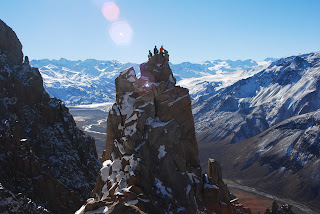
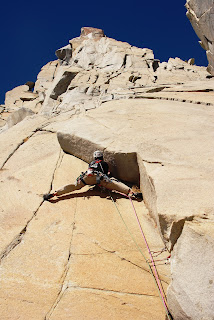
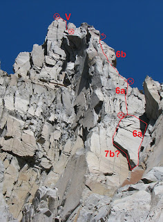

# Aguja: TORRE REAL

**URL blog:** https://escaladaensosneado.blogspot.com/2014/10/aguja-torre-real.html
**Publicado:** Octubre 2014 | **Autor:** Lucas Alzamora

---

## Descripción General

"La Torre Real es la más alejada desde el campamento, es **la última de las agujas del circo superior**." Tiene baja visibilidad hasta acercarse a su base porque la "Gran Torre del Tango" que está adelante la oculta.

**Aproximación:** La misma que para la Gran Torre del Tango pero continuando unos metros más por el canal. **Tiempo: ~3 horas.**

---

## Imágenes

URLs originales:
- https://blogger.googleusercontent.com/img/b/R29vZ2xl/AVvXsEg7tngWPhHemboxdbBoCBS6uSGi_oyQcm-g-kz2w-S-koOQf0-GSVKh4hqSRpkfIvPokPoHSaPHtRg2-ItSSZuQfA-Bv8Zd4jZy18hLjZq8-uX1ul9_kUVNWnDuo2I6g0qNOzmfbg5KOiqU/s320/DSC_3756.JPG
- https://blogger.googleusercontent.com/img/b/R29vZ2xl/AVvXsEglr01WdVRsguzk2TE4q5CJup8Iq9iSf3FKyQCx1Ev1Ly93troxTlGJGncUJ5T41V2n5ApYNRNZzvzGYKQnY9UX4LaGsT1VqpD-1wPDGM46JLKgBzRIt77Z_1l4Y0w-hxwdcBM8rBB6Rfmh/s320/DSC_3738.JPG
- https://blogger.googleusercontent.com/img/b/R29vZ2xl/AVvXsEhBpj2Q7FO8SJ_BzpKYMOwASpyp3LyOq6n-N3SUw1RB2kv1gT5gDL2Oaqg8faepJ6J98s6gcm-w6mPH-6UWk1qPl7qNRmB8lTp-H-3frultzHxDqIw_HX9GFCe1qi96B5gJqN7vJY--M_ZscZS4tJF3sLZz0K0BssBRIRNFqNyiPo/s1600/cumbre.jpg
- https://blogger.googleusercontent.com/img/b/R29vZ2xl/AVvXsEhL1XCzT7d0I4dcqewTJ4nLmdH8tRYYcwdcK1ZscPbL4veFntkoOFoFqPQngoaDyhkAQJ3RshwubbfG7z7nLUXWGbhhX7KaFXsUnsg1KTVppi42f-HQAmdHOYWS2ToR9UpfBhnyi1gekmCQ/s320/Torre+Real.JPG
- https://blogger.googleusercontent.com/img/b/R29vZ2xl/AVvXsEgewNo6wVV7LmkR6bjc3JvPjCkGgJhaja-UrQmIXmt0_C4GpzsvzUronS2P-rN8PA5Da-8tb9SRU7luQP0fj-RHdJkUpUVpebs710bMEmkWFOZ6yrAFTYIMRsD-MI1CTbIH7wvJg-87Hkqs/s1600/lon.jpg

---

## Vías

### Vía 1: "ALTA VISTA CLUB SOCIAL" ⭐⭐⭐⭐
- **Largo total:** 105 metros
- **Grado:** 7b? o 6b obligatorio
- **Primer ascenso:** Lucas Alzamora, Diego Nakamura, Carloncho Guerra y Diego Molina (29 de Abril 2012)

| Largo | Metros | Grado | Descripción |
|-------|--------|-------|-------------|
| 1° | 50m | **Opción A: 7b?** / **Opción B: 6a** | **A:** Diedro de fina fisura que luego se transforma en pequeño techo inclinado (7b?). **B:** Canal con buena fisura y más fácil de progresar (6a). Ambas convergen en una fisura vertical con algunos bloques sueltos y lajas hasta pequeña repisa. |
| 2° | 45m | 6b | "Fisura más evidente (sobre la derecha), sobre excelente granito naranja, que comienza ancha en un principio y luego se va angostando." Progresar por la zona más fácil hasta gran terraza en la base de la chimenea final. |
| 3° | 10m | 5+ | "Pocos metros fáciles por la ancha chimenea hasta la cumbre misma." |

**Equipo:** 2 juegos completos de camalots, 2 cuerdas de 50m, cintas largas y mosquetones varios, material para reunión (prever cordín para los rappeles).

**Bajada:**
- 1° rappel desde la cumbre sobre bloques naturales apuntando al canal de la derecha de la aguja.
- Destrepar con cuidado metros hasta encontrar el 2° punto de rappel sobre otro bloque a la altura de la reunión del primer largo.
- Este último rappel deja en la base de la aguja.

---

## Descripción Original

La Torre Real, es la mas alejada desde el campamento, es la última de las agujas del circo superior y poco visible hasta no estar cerca de su base, ya que "La gran torre" que esta inmediatamente delante de ella no deja diferenciarla. Al punto que en un principio parecía ser todo parte de la misma aguja.

Aproximación: La misma que para la "Gran torre" pero continuando unos metros mas por el canal.
Tiempo: 3hs

Vía: "Alta vista club social", 105mts, 7b? o 6b obligatorio, ****
(Lucas Alzamora, Diego Nakamura, Carloncho Guerra y Diego Molina, 29 de abril de 2012)

La vía comienza en la parte derecha de la pared, y transcurre por un marcado pilar que conduce directo a las grandes chimeneas de la cumbre. Podemos comenzar por un marcado diedro de fina fisura que luego se transforma en un pequeño techo inclinado (7b?) o tomar a la derecha del mismo por una especie de canal con buena fisura y mas fácil de progresar (6a), luego, ambos itinerarios se unen y nos llevan a una fisura vertical con algunos bloques sueltos y lajas hasta una pequeña repisa donde montamos la reunión (Largo 1°: 50mts, 7b? o 6a). De aquí salimos por unos bloques hasta conectar la fisura mas evidente (sobre la derecha), sobre excelente granito naranja, que comienza ancha en un principio y luego se va angostando hasta desaparecer. Es aquí donde buscamos ganar metros por la zona mas fácil, siempre sobre la derecha del pilar hasta llegar a una gran terraza en la base de la chimenea final, aquí montamos la reunión (Largo 2°: 45mts, 6b). Luego son pocos metros fáciles por la ancha chimenea hasta la cumbre misma donde encontraremos unos cordines en un bloque para el primer rappel (Largo 3°: 10mts, 5+).

Equipo: 2 juegos completos de camalots, 2 cuerdas de 50mts, cintas largas y mosquetones varios y material para reunión (prever cordín para los rappeles).
Bajada: Primero un rappel desde la cumbre sobre unos bloques naturales y apuntando al canal de la derecha de la aguja, unos metros destrepando con cuidado y encontraremos el segundo emplazamiento de rappel sobre otro bloque, a la altura de la reunión del primer largo, este ya nos deja en la base de la aguja.
