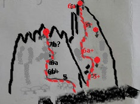

# Aguja: EL REY

**URL blog:** https://escaladaensosneado.blogspot.com/2014/10/aguja-el-rey.html
**Publicado:** Octubre 2014 | **Actualizado:** Abril 2020 | **Autor:** Lucas Alzamora

---

## Descripción General

La aguja se accede mediante **"el acarreo gris (grandes piedras desmoronadas) perfectamente visible desde la zona del campamento"**, ubicado al oeste de las agujas "El Misil" y "Adidas". La escalada comienza bordeando la pared izquierda (aguja "Fortaleza") hasta un punto donde no es posible continuar caminando.

**Aproximación:** Desde el campamento, **~3.5 a 4 horas** de aproximación.

---

## Imágenes

URL original:
- https://blogger.googleusercontent.com/img/b/R29vZ2xl/AVvXsEg39LucmZGTpzqMcIiclbjD0-Ory-jv-jawW9abY7wSzIL8O7Zd1DvA4irAiAjyXrBb8NuUZfCCU9QsWdfNJ2-vVrx3EWraC06r9RnPzj-KHlV9NDY62b-BuoxTiDO4z3b5-dW_8WlC7sdb/s1600/IMG-20200328-WA0038.jpg

---

## Vías

### Vía 1: "JAQUE MATE" ⭐⭐⭐
- **Largo total:** 200 metros
- **Grado:** 6a+
- **Primer ascenso:** Diego Nakamura y Diego Molina (25 de Marzo 2011)

**Descripción general:**

El primer largo consiste en un canal de piedras sueltas ganando altura sobre la cara izquierda hasta una repisa con bloque ancho. Luego se busca por la izquierda (10m) una fisura ancha diagonal superando un pequeño paso de desplome. Continúa una placa fisurada vertical que lleva al hombro norte de la cumbre. Se supera un bloque grande en la cara oeste para acceder a la chimenea hacia la cumbre.

**Bajada:** Unos metros a la derecha de la línea de subida, a veces sobre reuniones naturales y otras sobre chapas con argollas. ⚠️ **Prever material para abandonar.**

---

## Descripción Original

Se accede por el acarreo gris (grandes piedras desmoronadas) perfectamente visible desde la zona del campamento, que esta situado al oeste de la aguja "El misil" y "adidas".
Desde el campamento lleva aproximadamente 3,5 a 4hs de aproximación.
Bordeando la pared izquierda (aguja "Fortaleza") se llega a un punto desde donde no se puede seguir caminando, aquí comienza la escalada.

Vía: "Jaque mate", 200mts, 6a+, ***
(Diego Nakamura y Diego Molina, 25 de marzo de 2011)

El primer largo es un canal de piedras sueltas, ir ganando altura sobre la cara izquierda hasta llegar a una repisa con un bloque ancho y claro que tiene una fisura fina en su base.
Subir unos diez metros y buscar por la izquierda (a unos 10mts) el comienzo de una fisura ancha diagonal, para conseguirlo es necesario superar un pequeño paso de desplome. Luego de la fisura diagonal continua una placa fisurada bastante vertical que lleva al hombro de la aguja en el norte de la cumbre.
Desde aquí hay superar un bloque grande sobre la cara oeste de la aguja para acceder a la chimenea que conduce a la cumbre.
La bajada la realizamos unos metros a la derecha de la línea de subida, a veces sobre reuniones naturales y otras sobre chapas con argollas, prever material para abandonar.
